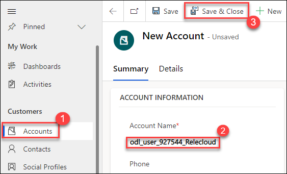
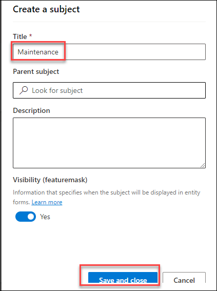

# Practice Lab 1 – Creating cases

## Scenario

You are a customer service manager at City Power & Light who has been tasked with trying the new case functionality before rolling it out to your users. In this lab, you will create new customer cases and create a phone calls associated with the cases.

> `Important`: The **[DeploymentId]/[DID] can be found under the environment details tab in the user name (example: `odl_user_xxxxxx.onmicrosoft.com`) **xxxxxx** is the [DeploymentID]**.

## Exercise 1 – Navigate to Dynamics 365 Customer Service Hub

In this exercise, you will navigate to the Dynamics 365 Customer Service Application.

### Task 1 – Navigate to Customer Service Hub app

1.  Navigate to Access <https://admin.powerplatform.microsoft.com/environments>.

2.  Select the **Prod-Env-[DeploymentID]** environment.

3.  Click **Open** located on the command bar.

4.  You should be in the **Customer Service Hub** app. If you are in a different app, click on the name of the app in the top left of the application next to Dynamics 365 and from the list of published apps, select the **Customer Service Hub** app

5.  You should now be showing the **Dashboard** view.

## Exercise 2 – Create case

In this exercise, you will create an Account, a Contact, and a Case record. You will also add a Phone Call activity to the case.

### Task 1 – Create Account

1.  Click on **Accounts** in the **Customers** section of the sitemap.

2.  Click **+ New** located on the command bar.

3.  Enter **odl_user_DID_Relecloud** for **Account Name**.

4.  Click **Save & Close**.

    

### Task 2 – Create Contacts

1.  Click on **Contacts** in the **Customers** section of the sitemap.

2.  Click **+ New** located on the command bar.

3.  Enter **odl_user_DID_Jane** for **First Name**.

4.  Enter **Doe** for **Last Name**.

5.  Enter *your prefix ex. odl_user_DID* in the **Account Name** field, click on the lookup icon and select the account **odl_user_DID_Relecloud**.

6.  Click **Save & Close**.

    

7.  Click **+ New** located on the command bar.

8.  Enter **odl_user_DID_Jon** for **First Name**.

9.  Enter **Doe** for **Last Name**.
10.  Enter *your prefix ex. odl_user_DID* in the **Account Name** field, click on the lookup icon and select the account **odl_user_DID_Relecloud**.

11.  Click **Save & Close**.

     

### Task 3 – Create Case

1.  Click on the **Customer Service Hub** app from the top and select **Customer service admin**.

    
    
1.  In the site map, select **Case Settings** in Customer Support. The Case Settings page appears.

1.  In the Subjects section, select **Manage**.

    

1.  On the Subject tree page, in the Subject tree management area, select Add.

1.  In the Create a subject dialog, enter the following information and remaining leave default:
    
    a. Title: Type **Maintenance** for the subject.
    b. Set the toggle for Visibility to **Yes** if you want the subject to be available for the agent.
    
    
    
1.  Select Save and close.

1.  Click on **Cases** in the **Service** section of the sitemap.

2.  Click **+ New Case** located on the command bar.

3.  Enter **odl_user_DID_Defective Screen** for **Case Title**.

4.  Click on the **Subject** field and type **Maintenance** into the box and press enter.

5.  Enter *your prefix ex. odl_user_DID* in the **Customer** field, click on the lookup icon and select the account **odl_user_DID_Relecloud**.

6.  Select **Phone** from the **Origin** drop-down field.

7.  Enter **Laptop display is too bright** in the **Description** field.

8.  Click on the **Identify** stage in the business process flow.

    

9. Enter *your prefix ex. odl_user_DID* in the **Find Contact** field, click on the lookup icon and select the **Jane Doe** contact you created in Task 2.

    

10. Select the **Details** tab.

11. Select **Problem** from the **Type** drop-down field.

12. Click **Save**.

    

13. Click on the **Identify** stage in the business process flow, and select **Next Stage**.

    

14. Select the **Summary Tab**. In the Timeline, click on **+**, and select **Phone Call**.

    

15. Enter **odl_user_DID_further details** for **Subject**.

16. Select **Outgoing** from the **Direction** drop-down field.

17. Ensure that your user record is set for **Call From**.

18. Ensure that the Jane Doe contact is set for **Call To**.

19. Select **15 minutes** from the **Duration** drop-down field.

20. Select tomorrow's date and 9:00AM for **Due**.

21. Select **High** from the **Priority** drop-down field.

22. Select **Save & Close**

    

## Exercise 3 – Create case from an activity

In this exercise, you will create a Phone Call activity and then convert the activity to a Case.

### Task 1 – Create Phone Call activity

1.  Click on **Contacts** in the **Customers** section of the sitemap.

2.  select the **Jon Doe** contact you created in Task 2 from the list.

3.  In the Timeline, click on **+**, and select **Phone Call**.

    

4.  Enter **odl_user_DID_Service required** for **Subject**.

5.  Select **Incoming** from the **Direction** drop-down field.

6.  Ensure that the Jon Doe contact is set for **Call From**.

7.  Ensure that your user record is set for **Call To**.

8.  In the Description field, enter **Annual service needs to be scheduled for Jon**

9.  Click into the **Duration field** and type **10 minutes**.

10. Select today's date for **Due**.

11. Select **Save and Close**

    

### Task 2 – Covert Phone Call activity

1.  In the Timeline, click on the **Open Record** icon for the phone call you just created.

    

2.  Click **Convert To** located on the command bar [Note:you may need to click on the ellipsis (...)] and select **To Case**.

3.  Click on **Customer** field in the **Convert to Case** window.

4.  Enter *your prefix ex. odl_user_DID* and select the **Jon Doe** contact you created in Task 2.

5.  Click **Convert**.

    

6.  Review the case that was created. Note that the customer is linked to the contact and the origin is set to Phone.

    
