# Practice Lab 1 – Creating cases

## Scenario

You are a customer service manager at City Power & Light who has been tasked with trying the new case functionality before rolling it out to your users. In this lab, you will create new customer cases and create a phone calls associated with the cases.

## Exercise 1 – Create case

In this exercise, you will create an Account, a Contact, and a Case record. You will also add a Phone Call activity to the case.

### Task 1 – Create Account

1.  On **Customer Service Hub** page, click on **Accounts (1)** from the **Customers** section of the sitemap and click on **+ New (2)

     
     

3.  Enter **Relecloud** for **Account Name** and click **Save & Close (3)**.

    
    
> **Congratulations** on completing the task! Now, it's time to validate it. Here are the steps:
> - Select the **Lab Validation** tab located at the upper right corner of the lab guide section.
> - Hit the Validate button for the corresponding task. If you receive a success message, you can proceed to the next task. 
> - If not, carefully read the error message and retry the step, following the instructions in the lab guide.
> - If you need any assistance, please contact us at labs-support@spektrasystems.com. We are available 24/7 to help you out.

### Task 2 – Create Contacts

1.  Click on **Contacts (1)** in the **Customers** section of the sitemap.

2.  Click **+ New** located on the command bar.

3.  Enter **odl_user_DID_Jane (2)** for **First Name**.

4.  Enter **Doe (3)** for **Last Name**.

5.  Enter *your prefix ex. odl_user_DID* in the **Account Name** field, click on the lookup icon and select the account **odl_user_DID_Relecloud (4)**.

6.  Click **Save & Close (5)**.

    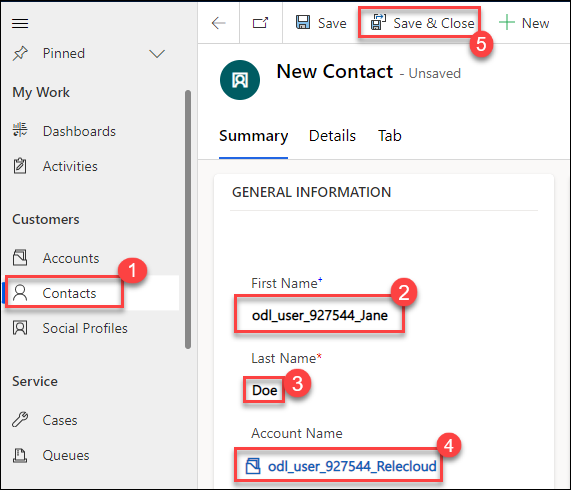

7.  Click **+ New** located on the command bar.

8.  Enter **odl_user_DID_Jon (2)** for **First Name**.

9.  Enter **Doe (3)** for **Last Name**.
10.  Enter *your prefix ex. odl_user_DID* in the **Account Name** field, click on the lookup icon and select the account **odl_user_DID_Relecloud (4)**.

11.  Click **Save & Close (5)**.

     
     
> **Congratulations** on completing the task! Now, it's time to validate it. Here are the steps:
> - Select the **Lab Validation** tab located at the upper right corner of the lab guide section.
> - Hit the Validate button for the corresponding task. If you receive a success message, you can proceed to the next task. 
> - If not, carefully read the error message and retry the step, following the instructions in the lab guide.
> - If you need any assistance, please contact us at labs-support@spektrasystems.com. We are available 24/7 to help you out.

### Task 3 – Create Case

1.  Click on the **Customer Service Hub** app from the top and select **Customer service admin**.

    
    
1.  In the site map, select **Case Settings** in Customer Support. The Case Settings page appears.

1.  In the Subjects section, select **Manage**.

    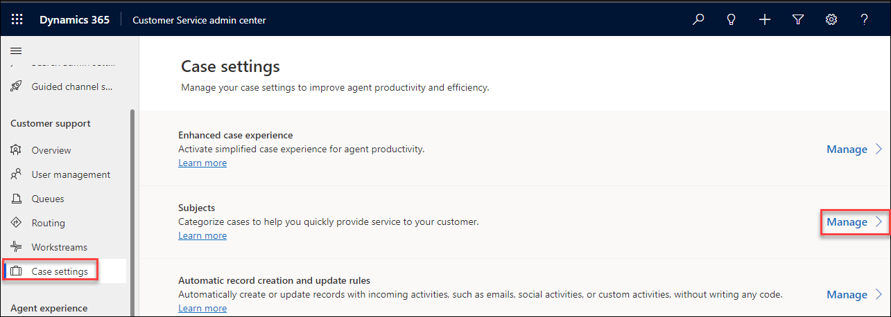

1.  On the Subject tree page, in the Subject tree management area, select Add.

1.  In the Create a subject dialog, enter the following information and remaining leave default then Select **Save and close (3)**.:
    
  - Title: Type **Maintenance (1)** for the subject.
    
  - Set the toggle for Visibility to **Yes (2)** if you want the subject to be available for the agent.
    
    
    
1. Again Click on **Customer service admin**  the app from the top and select  **Customer Service Hub** .
    
1.  Click on **Cases(1)** in the **Service** section of the sitemap.

1.  Click **+ New Case** located on the command bar.

1.  Enter **odl_user_DID_Defective Screen(2)** for **Case Title**.

1.  Click on the **Subject** field and type **Maintenance(3)** into the box and press enter.

1.  Enter *your prefix ex. odl_user_DID* in the **Customer** field, click on the lookup icon and select the account **odl_user_DID_Relecloud(4)**.

1.  Select **Phone(5)** from the **Origin** drop-down field.

1.  Enter **Laptop display is too bright(5)** in the **Description** field.

1.  Click on the **Identify** stage in the business process flow.

    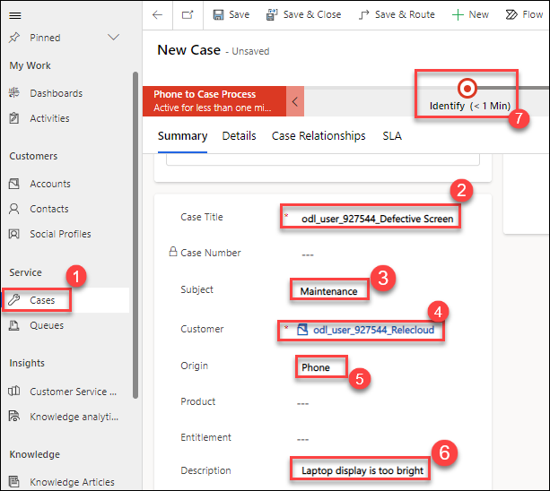

1. Enter *your prefix ex. odl_user_DID* in the **Find Contact** field, click on the lookup icon and select the **Jane Doe** contact you created in Task 2.

    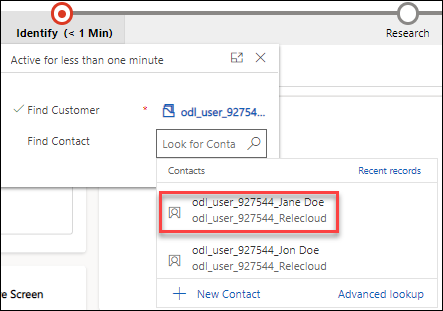

1. Select the **Details(1)** tab then Select **Problem** from the **Type(2)** drop-down field and Click on **Save(3)**.

    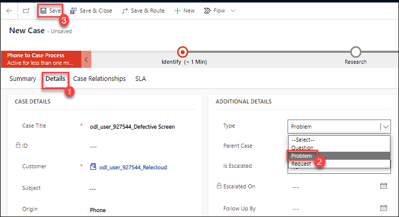

1. Click on the **Identify** stage in the business process flow, and select **Next Stage**.

    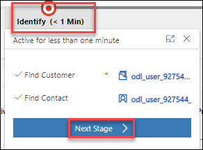

1. Select the **Summary Tab(1)**. In the Timeline, click on **+(2)**, and select **Phone Call(3)**.

    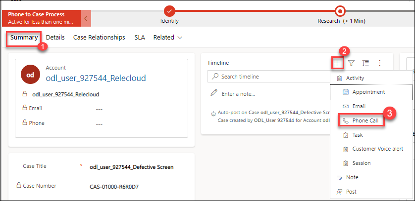

1. Enter **odl_user_DID_further details(1) ** for **Subject**.

1. Select **Outgoing (2)** from the **Direction** drop-down field.

1. Ensure that your user record is set for **Call From**.

1. Ensure that the Jane Doe contact is set for **Call To**.

1. Select **15 minutes (3)** from the **Duration** drop-down field.

1. Select tomorrow's date and 9:00AM (4) for **Due**.

1. Select **High (5)** from the **Priority** drop-down field.

1. Select **Save & Close (6)**

    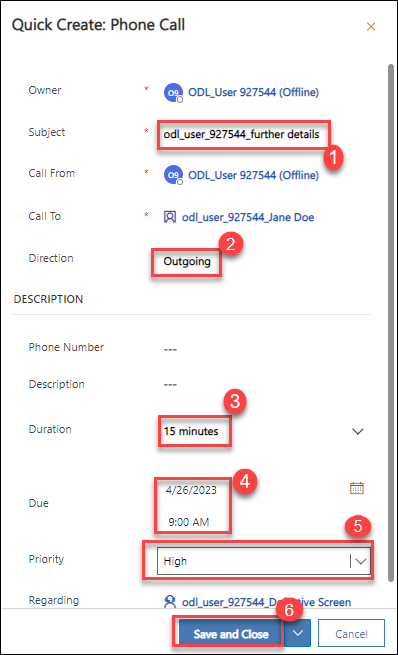

## Exercise 2 – Create case from an activity

In this exercise, you will create a Phone Call activity and then convert the activity to a Case.

### Task 1 – Create Phone Call activity

1.  Click on **Contacts (1)** in the **Customers** section of the sitemap.

2.  select the **Jon Doe (2)** contact you created in Task 2 from the list.

3.  In the Timeline, click on **+ (3)**, and select **Phone Call (4)**.

    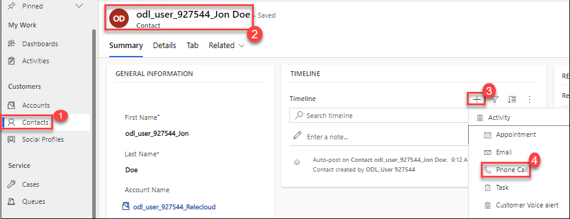

4.  Enter **odl_user_DID_Service required (1)** for **Subject**.

5.  Select **Incoming (2)** from the **Direction** drop-down field.

6.  Ensure that the Jon Doe contact is set for **Call From**.

7.  Ensure that your user record is set for **Call To**.

8.  In the Description field, enter **Annual service needs to be scheduled for Jon (3)**.

9.  Click into the **Duration field** and type **10 minutes (4)**.

10. Select today's date and duration 8 AM (5) for **Due**.

11. Select **Save and Close (6)**

    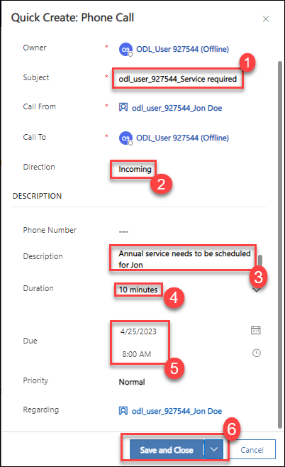

### Task 2 – Covert Phone Call activity

1.  In the Timeline, click on the **Open Record** icon for the phone call you just created.

    

2.  Click **Convert To** located on the command bar [Note: you may need to click on the ellipsis (...)] and select **To Case**.

3.  Click on **Customer** field in the **Convert to Case** window.

4.  Enter *your prefix ex. odl_user_DID* and select the **Jon Doe** contact you created in Task 2.

5.  Click **Convert**.

    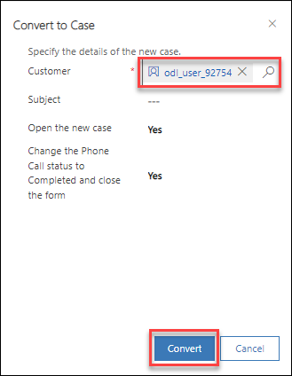

6.  Review the case that was created. Note that the customer is linked to the contact and the origin is set to Phone.

    
    
**Result:** You have successfully Created the cases in dynamic 365 customer service hub app. 
