# Practice Lab 1 – Creating cases

## Scenario

You are a customer service manager at City Power & Light who has been tasked with trying the new case functionality before rolling it out to your users. In this lab, you will create new customer cases and create a phone call associated with the cases.

## Exercise 1 – Create case

In this exercise, you will create an Account, a Contact, and a Case record. You will also add a Phone Call activity to the case.

### Task 1 – Create Account

1.  On **Customer Service Hub** page, click on **Accounts (1)** from the **Customers** section of the sitemap and click on **+ New (2)**.

     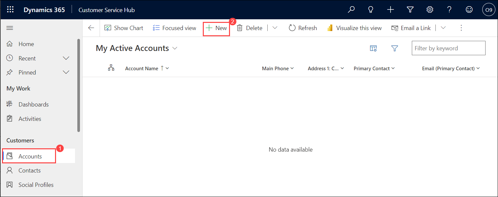

3.  Enter **Relecloud (1)** for **Account Name** and click **Save & Close (2)**.

     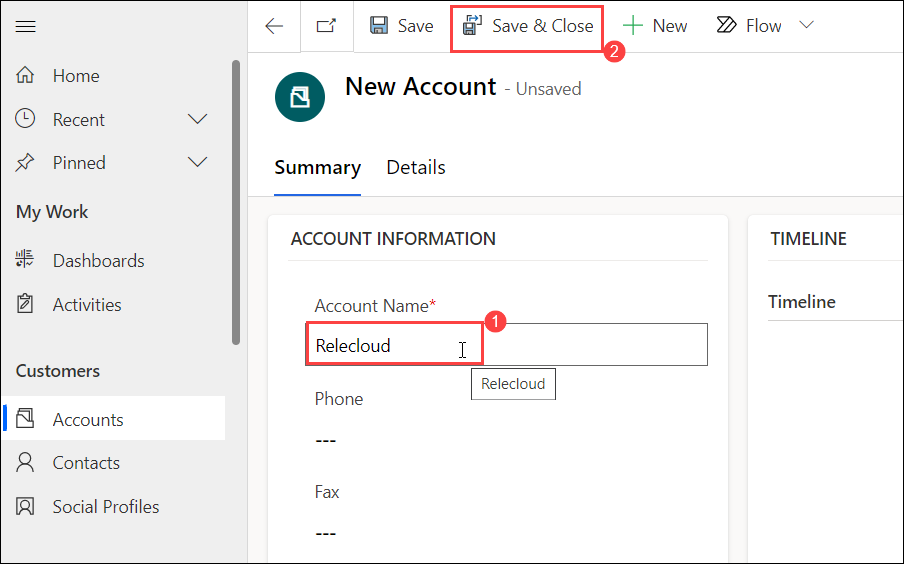
    
     > **Congratulations** on completing the task! Now, it's time to validate it. Here are the steps:
     > - Select the **Lab Validation** tab located at the upper right corner of the lab guide section.
     > - Hit the Validate button for the corresponding task. If you receive a success message, you can proceed to the next task. 
     > - If not, carefully read the error message and retry the step, following the instructions in the lab guide.
     > - If you need any assistance, please contact us at labs-support@spektrasystems.com. We are available 24/7 to help you out.

### Task 2 – Create Contacts

1.  Click on **Contacts (1)** in the **Customers** section of the sitemap and click on **+ New (2)** located on the command bar.

     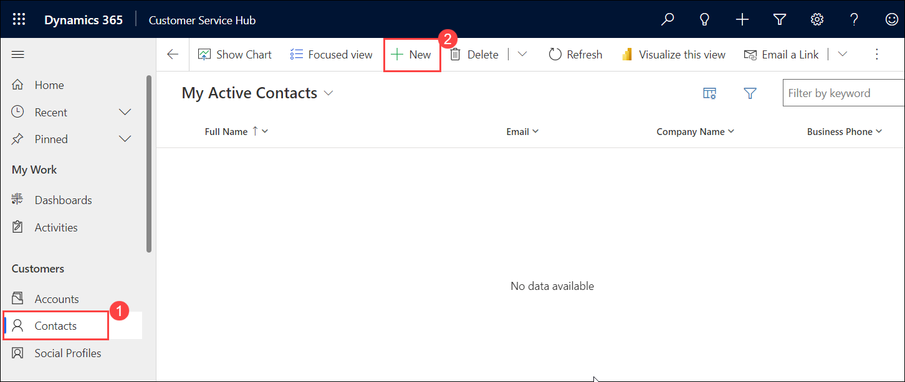
     
1. Follow the below instructions on **New Contact** page:
 
   - First Name: Enter **Jane (1)**.

   - Last Name: Enter **Doe (2)** for **Last Name**.

   - Account Name: Enter **Relecloud (3)**.

   - Click **Save & Close (4)**.

    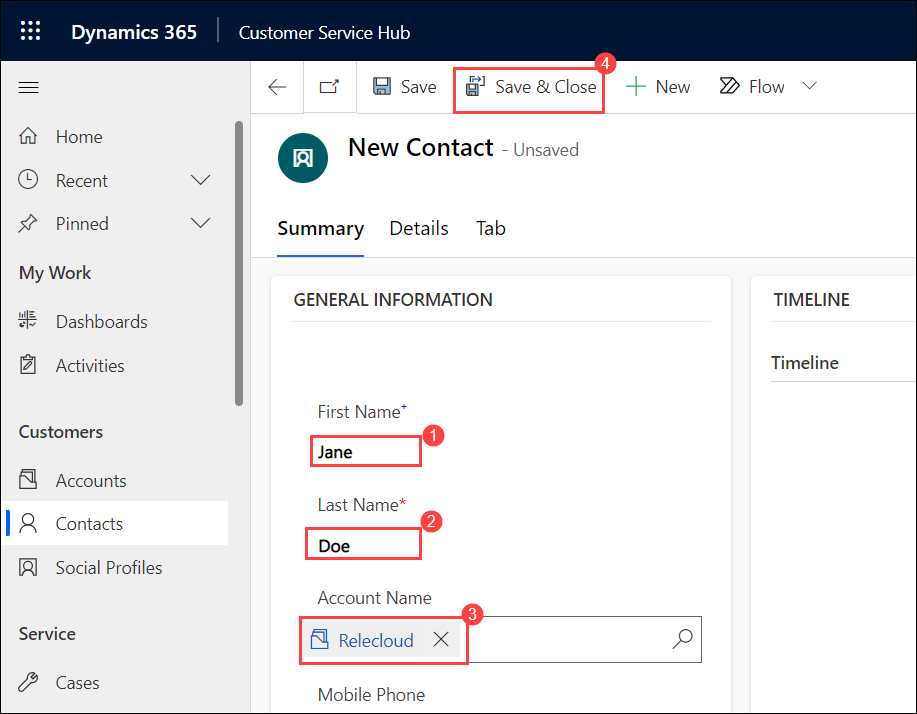

7.  Click **+ New** located on the command bar on **Contacts** page

     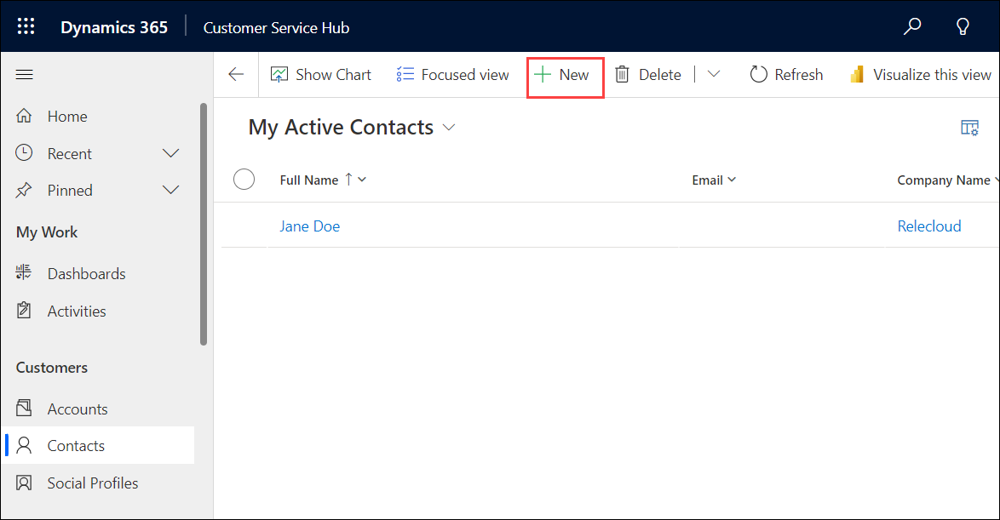
     
1. Follow the below instructions on **New Contact** page:
 
   - First Name: Enter **Jon (1)**.

   - Last Name: Enter **Doe (2)** for **Last Name**.

   - Account Name: Enter **Relecloud (3)**.

   - Click **Save & Close (4)**.

    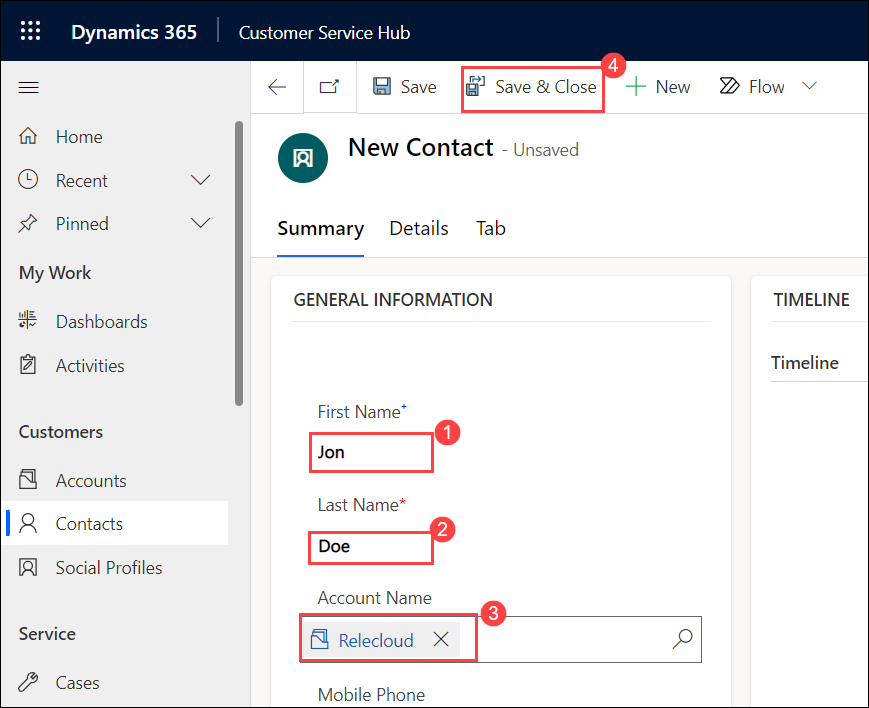
     
     > **Congratulations** on completing the task! Now, it's time to validate it. Here are the steps:
     > - Select the **Lab Validation** tab located at the upper right corner of the lab guide section.
     > - Hit the Validate button for the corresponding task. If you receive a success message, you can proceed to the next task. 
     > - If not, carefully read the error message and retry the step, following the instructions in the lab guide.
     > - If you need any assistance, please contact us at labs-support@spektrasystems.com. We are available 24/7 to help you out.

### Task 3 – Create Case

1.  Click on the **Customer Service Hub (1)** app from the top and select **Customer service admin (2)**.

    
    
1.  In the site map, select **Case Settings (1)** from Customer Support and click on **Manage (2)** next to **Subjects**.

     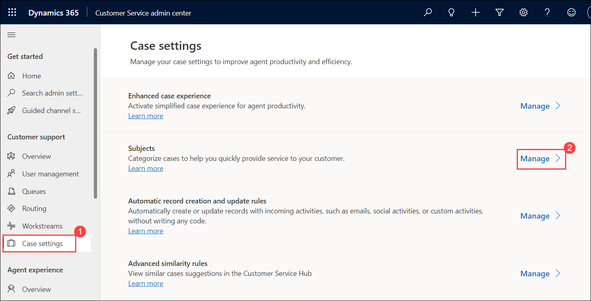
     

1.  On the **Subject tree** page, select **Add** next to **Subject tree management**.

     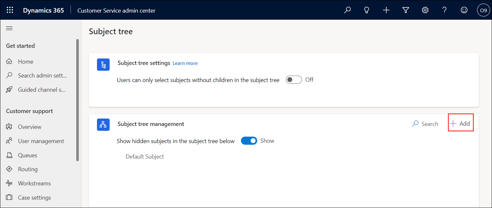
     
1.  In the Create a subject dialog, enter the following information and remaining leave default then Select **Save and close**:
    
     - Title: type **Maintenance (1)** for the subject.
    
     - Click on **Save and Close (2)**
         
    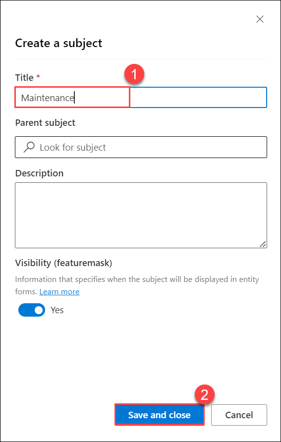
    
1.  On the **Subject tree** page, select **Add** next to **Subject tree management**.
     
1.  In the Create a subject dialog, enter the following information and remaining leave default then Select **Save and close**.:
    
     - Title: Type **Service (1)** for the subject.
    
     - Click on **Save and Close (2)**
     
     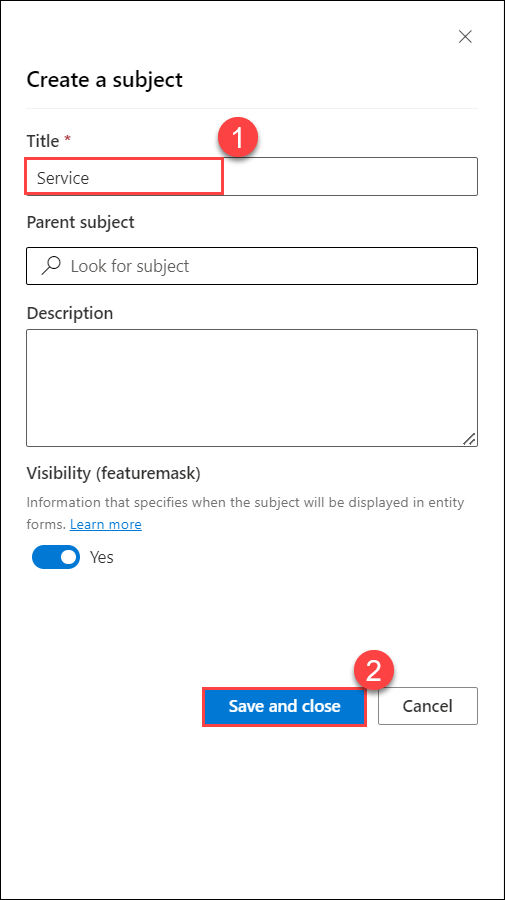
    
1. Again Click on **Customer service admin**  the app from the top and select  **Customer Service Hub**.
    
1. Click on **Cases (1)** in the **Service** section of the sitemap and click on **+ New Case (2)** located on the command bar.

    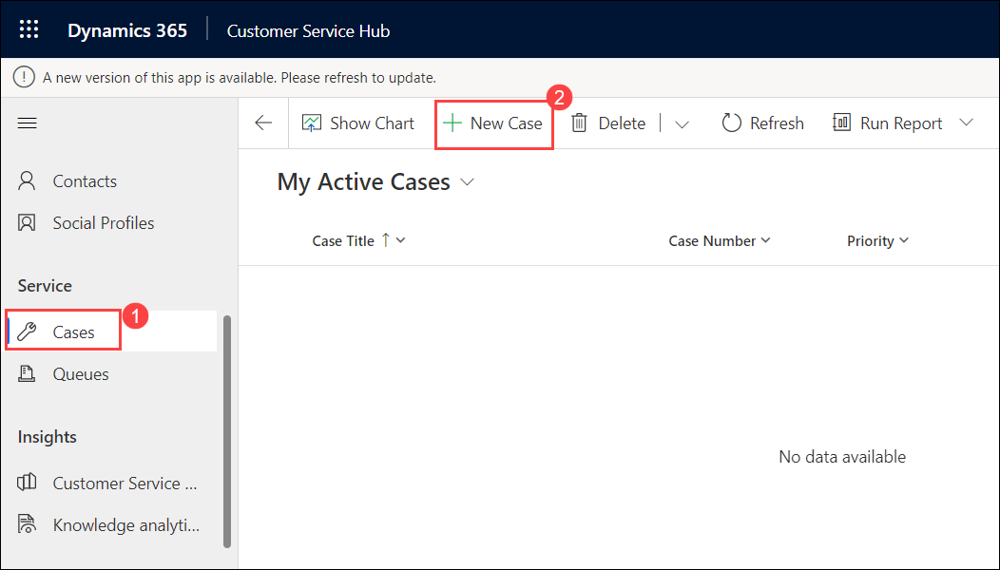

1. Follow the below instructions on **New Case** page:

   - Case Title: Enter **Defective Screen (1)**

   - Subject: **Maintenance (2)**.

   - Customer:  Click on **Relecloud (3)**.

   - Origin: Choose **Phone (4)**
 
   - Description: Enter **Laptop display is too bright (5)**

   - Click on **Identify (6)**

     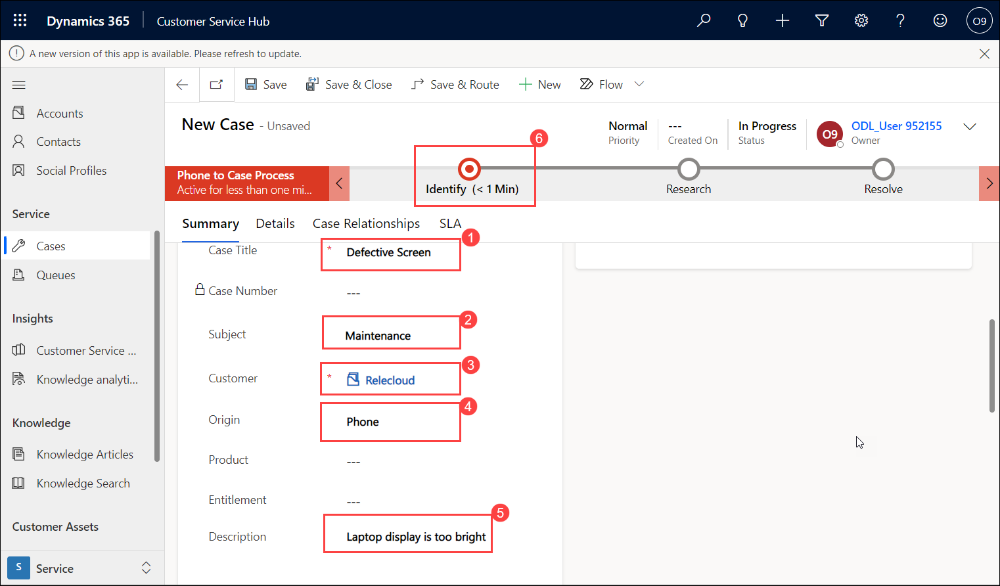

1. In the **Find Contact (1)** field, click on the **look for Contact (2)** and select the **Jane Doe (3)** contact you created in Task 2.

    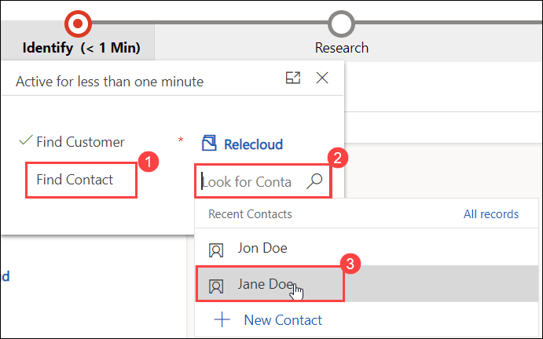

1. Select the **Details (1)** tab then select **Problem (2)** from the **Type** drop-down field and Click on **Save (3)**.

    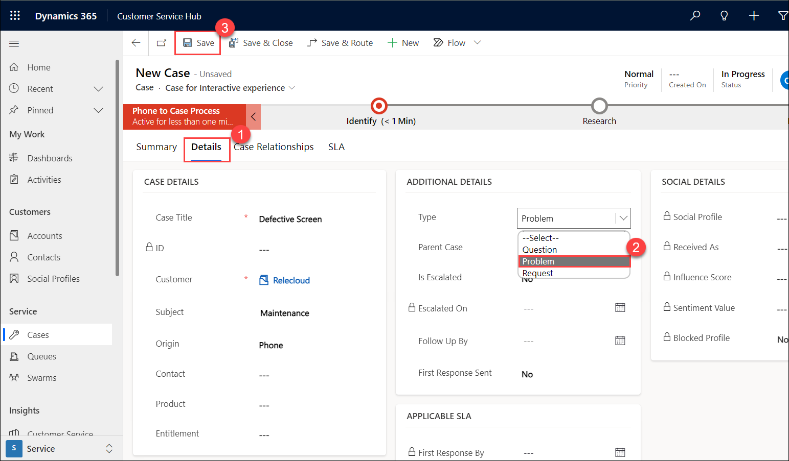

1. Click on the **Identify (1)** stage in the business process flow and select **Next Stage (2)**.

    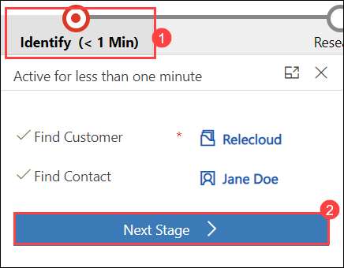

1. Select the **Summary Tab (1)**. In the Timeline, click on **+ (2)**, and select **Phone Call (3)**.

    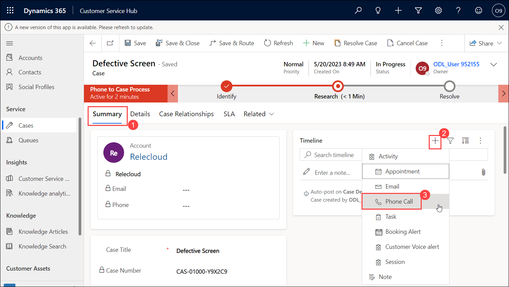

1. On **Quick Create: Phone call** page, follow the below instructions:

    - Subject: Enter **further details (1)**
    - Ensure that your user record is set for **Call From (2)**.
    - Ensure that the Jane Doe contact is set for **Call To (3)**.
    - Direction: Choose **Outgoing (4)**
    - Duration: Choose **15 minutes (5)**
    - Due: Select tomorrow's date **(6)** and **9:00AM (7)**.
    - Priority: Choose **High (8)**
    - Select **Save & Close (9)**.

      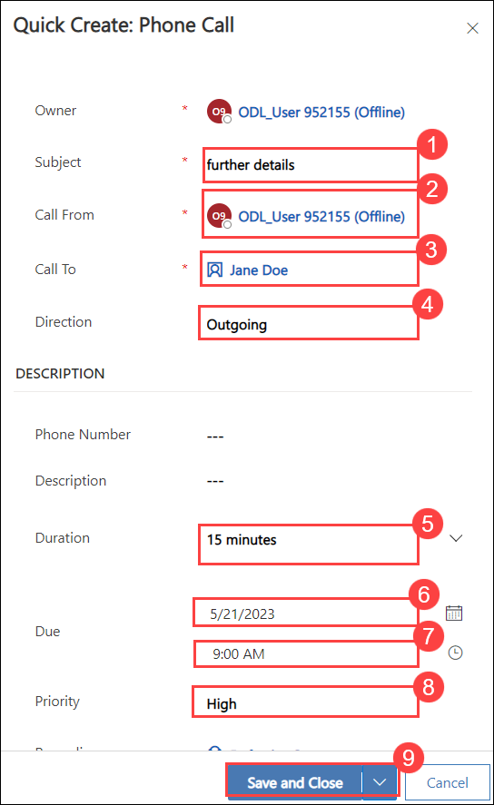
      
## Exercise 2 – Create case from an activity

In this exercise, you will create a Phone Call activity and then convert the activity to a Case.

### Task 1 – Create Phone Call activity

1.  Click on **Contacts (1)** in the **Customers** section of the sitemap and select **Jon Doe (2)** contact you created in Task 2 from the list.

      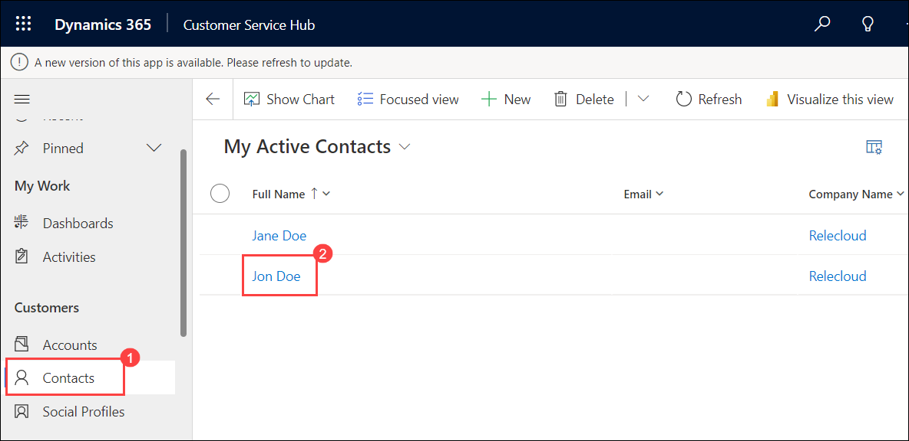
      
3.  In the Timeline, click on **+ (1)**, and select **Phone Call (2)**.

    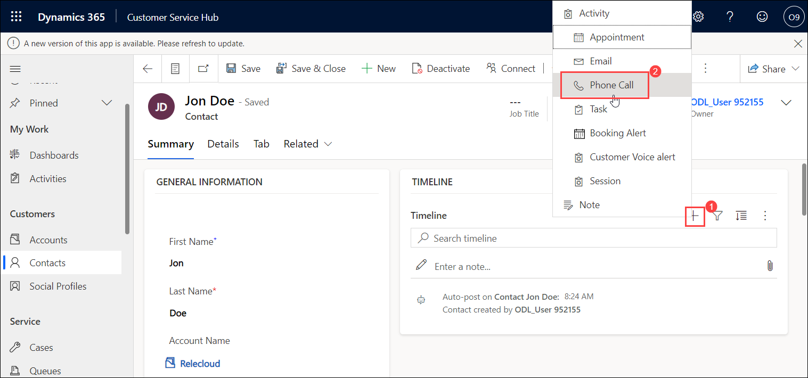

1. On **Quick Create : Phone call** page, follow the below instructions:

    - Subject : Enter **Service required (1)**
    - Ensure that the **Jon Doe** contact is set for **Call From (2)**.
    - Ensure that your user record is set for **Call To (3)**.
    - Direction : Choose **Incoming (4)**
    - Description : Enter **Annual service needs to be scheduled for Jon (5)**
    - Duration : Choose **10 minutes (6)**
    - Due : Select today's date  and **8:00AM (7)**.
    - Select **Save & Close (8)**.

     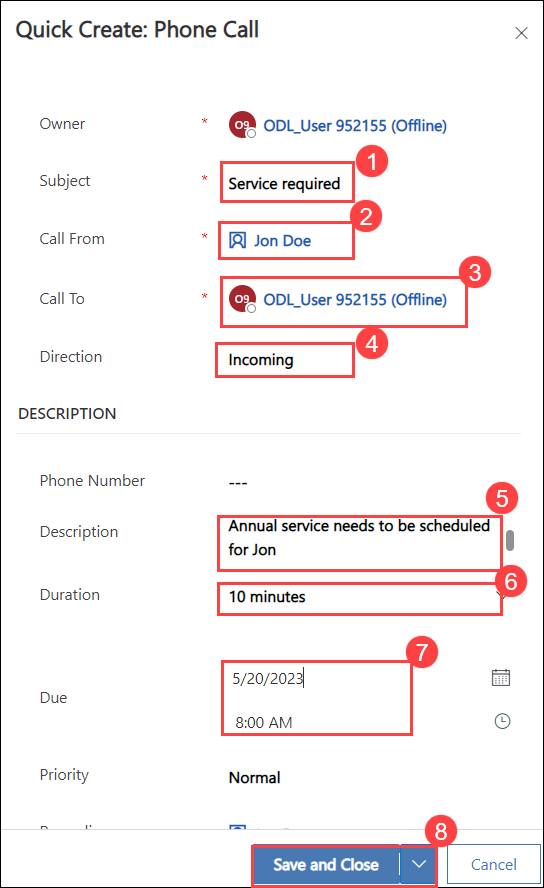
     
     > **Congratulations** on completing the task! Now, it's time to validate it. Here are the steps:
     > - Select the **Lab Validation** tab located at the upper right corner of the lab guide section.
     > - Hit the Validate button for the corresponding task. If you receive a success message, you can proceed to the next task. 
     > - If not, carefully read the error message and retry the step, following the instructions in the lab guide.
     > - If you need any assistance, please contact us at labs-support@spektrasystems.com. We are available 24/7 to help you out.

### Task 2 – Covert Phone Call activity

1.  In the Timeline, click on the **Open Record** icon for the phone call you just created.

    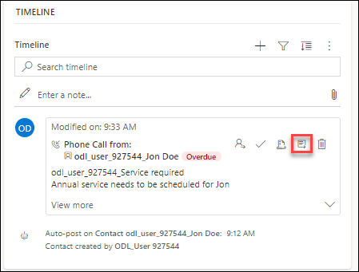

2.  Click **Convert To** located on the command bar and click on **To Case**
  
     > **Note:** you may need to click on the ellipsis (...).

     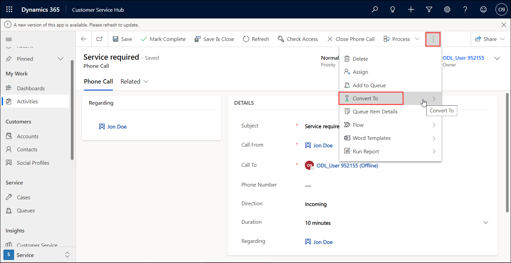
     
     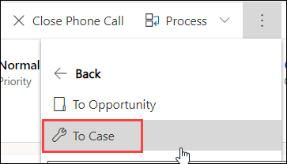

5.  Leave the options as default and click **Convert**.

    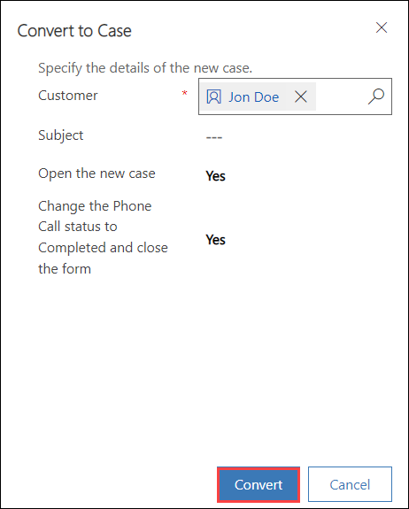

6.  Review the case that was created is closed now. Note that the customer is linked to the contact and the origin is set to Phone.

    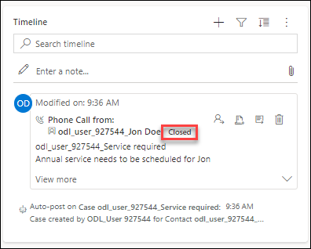
    
**Result:** You have successfully created the cases in dynamic 365 customer service hub app. 
