# Practice Lab 2 – Queues

## Lab scenario

You are a customer service manager at City Power & Light. You need to create queues for the customer service representatives to use for processing cases. In this lab, you will create a create multiple queues and add cases to activities to queues.

## Lab objective
In this lab, you will perform:
+ Exercise 1 – Create Queues

## Estimated time: 30 minutes

## Exercise 1 – Create Queues

In this exercise, you will create four queues.

### Task 1 – Create Queues

1.  Click on the **Customer Service Hub (1)** app from the top and select **Customer service admin (2)**.

    

1. Click on **Queues (1)** in the **Customer support** section and then click on **Manage (2)** from right side.

    

1.  Click **+ New** located on the command bar.

1.  Enter **Support (1)** for **Name** and select **Public (2)** for **Type**, and <inject key="AzureAdUserEmail"></inject> for **Incoming Email (3)**, then click on **Save (4)**.

    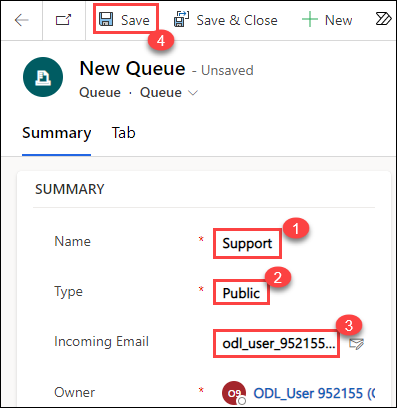

1.  Again, click **+ New** located on the command bar.

1.  Enter **Bronze (1)** for **Name** and select **Private (2)** for **Type**.

1.  Click **Save (3)**.

     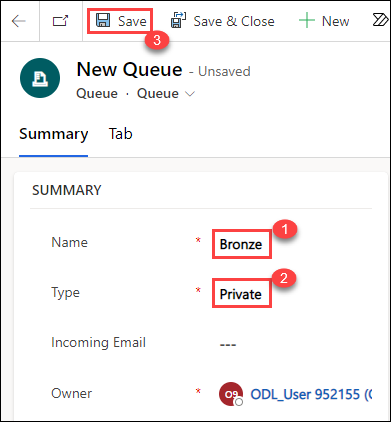

1. Click **+ New**.

1. Enter **Silver** for **Name** and select **Private** for **Type**.

1. Click **Save**.

1. Click **+ New**.

1. Enter **Gold** for **Name** and select **Private** for **Type**.

1. Click **Save**.

1. Click on **Queues (1)** in the **Customer support** section and then click on **Manage (2)**.

    

1. Select the **My Active Queues (1)** view.

1. You should now see a private queue that was created for your user automatically, the public queue, and private queues that you created in this lab.

    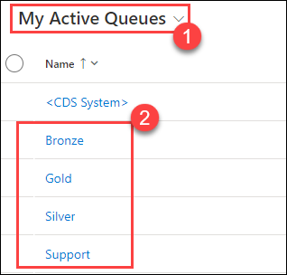

1. Navigate back to the previous **services** tab of **Customer Services Hub**.

1. On the services page, refresh the page and Click **Queues** under the **Service** section.

1. Change the view from **Items I am working on** to **All items**.

    

1. Review the options in the list for **Queues I'm a member of**. You should be able to see the four queues you created.

    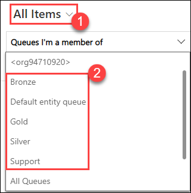
    
> **Congratulations** on completing the task! Now, it's time to validate it. Here are the steps:
> - Select the **Lab Validation** tab located at the upper right corner of the lab guide section.
> - Hit the Validate button for the corresponding task. If you receive a success message, you can proceed to the next task. 
> - If not, carefully read the error message and retry the step, following the instructions in the lab guide.
> - If you need any assistance, please contact us at labs-support@spektrasystems.com. We are available 24/7 to help you out.

### Task 2 – Add cases to queues

1.  Open the **Customer Service Hub** app.

1.  Click on **Cases (1)** in the **Service** section of the sitemap.

1.  Select the **My Active cases** from the drop down and you will be able to see **Service Required**.

    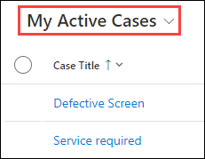

1.  Select the **Service Required (2)** case you created in the earlier lab and then click **Add to Queue (3)** located on the command bar.

    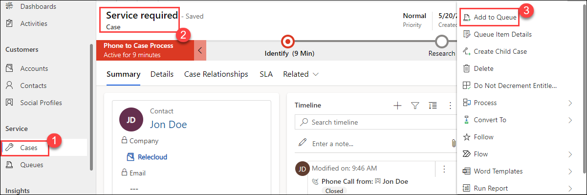

1.  In the **Queue** field, click on the lookup icon and select the **Bronze (1)** queue you created in the task and then **Add (2)**

    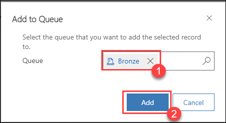

1.  Click on **Cases (1)** in the **Service** section of the sitemap. Select the **Defective Screen (2)** case you created in the earlier lab and then click on **Add to Queue (3)** located on the command bar.

    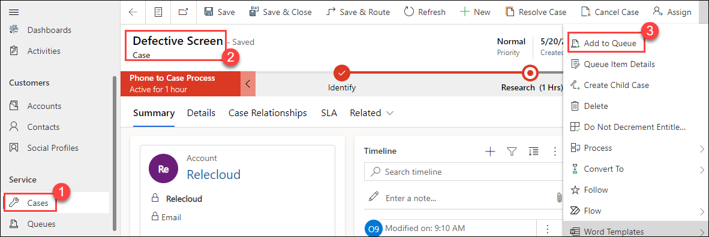

1. In the **Queue** field, click on the lookup icon and select the **Support (1)** queue you created in the task

1. Click **Add (2)**

    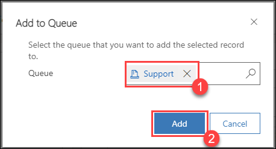

1. Click **Queues (1)** under the **Service** section. Change the view from **Items I am working on** to **All items (2)**. You should see the **Service Required** case listed for the Bronze queue.

    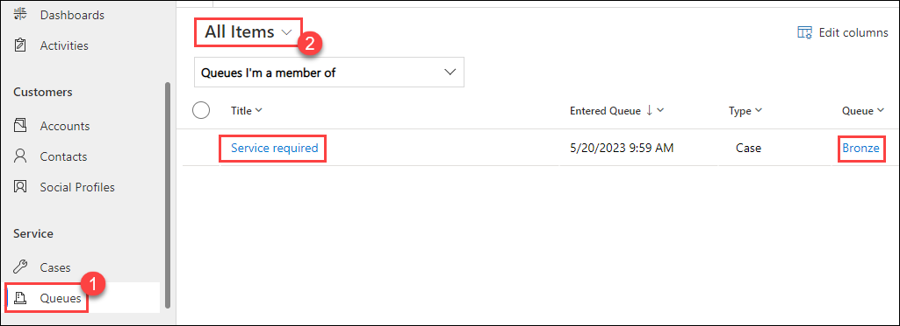

1. Change the queue selector from **Queues I'm a member of (1)** to **All Public Queues (2)**.

    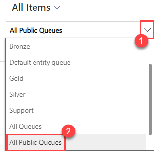

1. You should see the Defective Screen case listed for the Support queue. Change the queue selector to **All Public Queues**.

    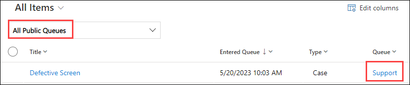

> **Congratulations** on completing the task! Now, it's time to validate it. Here are the steps:
> - Select the **Lab Validation** tab located at the upper right corner of the lab guide section.
> - Hit the Validate button for the corresponding task. If you receive a success message, you can proceed to the next task. 
> - If not, carefully read the error message and retry the step, following the instructions in the lab guide.
> - If you need any assistance, please contact us at labs-support@spektrasystems.com. We are available 24/7 to help you out.

### Task 3 – Perform actions on queue items

1.  Click **Queues** under the **Service** section. 

1.  Change the view from **Items I am working on** to **Items available to work on (1)**. Change the queue selector to **Queues I'm a member of (2)**. You should see the Service Required case listed for the Bronze queue.

    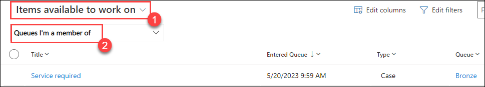

1.  Click to the left of the case in the queue to **select it (1)** then click on **Queue Item Details (2)** located on the command bar.

    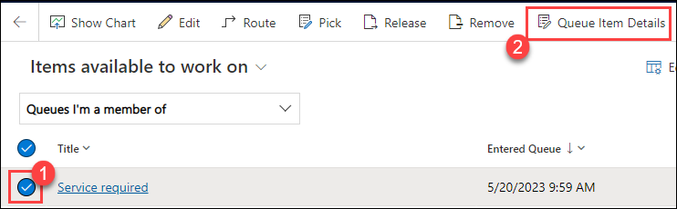

1.  Note that **Worked By** is blank.

    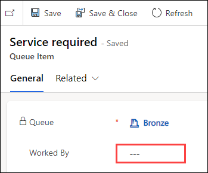

1.  Click **Close** from the three dots.

1.  Click to the left of the case in the queue to **select it (1)** then click on **Pick (2)** located on the command bar.

    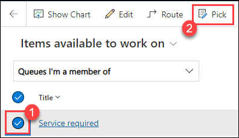

1. Leave the *Also remove the item(s) from the Queue* option set to **No (1)** and click **Pick (2)**.

    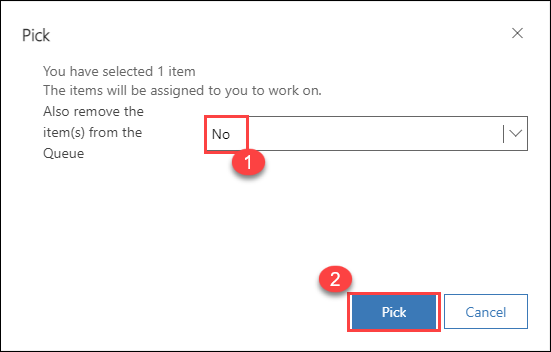

1. Change the view from **Items available to work on** to **Items I am working on**.

1. Click to the left of the case in the queue to select it.

1. Click **Queue Item Details** located on the command bar.

1. Note that **Worked By** is set to **<inject key="AzureAdUserEmail"></inject>** user.

    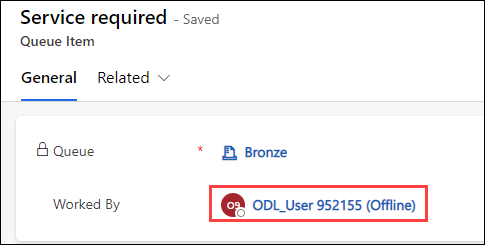

1. Click **Close**.

1. Click to the left of the case in the queue to **select it (1)**.

1. Click **Release (2)** located on the command bar and click **Release (3)**.

    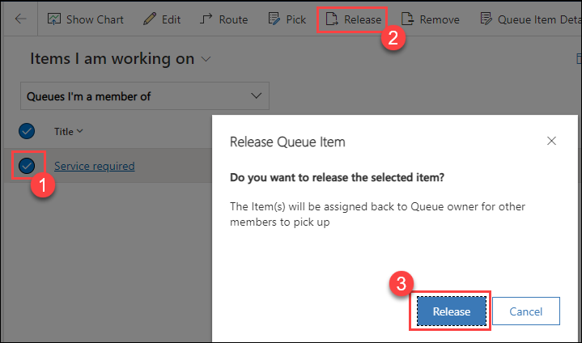
    
    **Result:** You have accomplished the creation of queues, inclusion of cases in the queues, and execution of actions on queue items.

### Review
In this lab, you have completed:
- Create a queues and adding cases to queues
- Perform action on queue items

### **Proceed with the next Lab.**
