# Practice Lab 2 – Queues

## Scenario

You are a customer service manager at City Power & Light. You need to create queues for the customer service representatives to use for processing cases. In this lab, you will create a create multiple queues and add cases to activities to queues.

## Exercise 1 – Create Queues

In this exercise, you will create four queues.

### Task 1 – Create Queues

1.  Click on the **Customer Service Hub (1)** app from the top and select **Customer service admin (2)**.

    

1. Click on **Queues (1)** in the **Customer support** section and then click on **Manage (2)** from right side.

    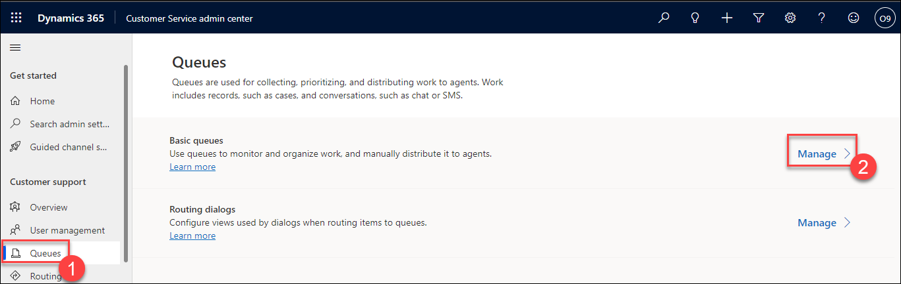

1.  Click **+ New** located on the command bar.

1.  Enter **odl_user_DID_Support (1)** for **Name** and select **Public (2)** for **Type**, and enter the user name from the environment details pages of the lab guide ex. `odl_user_926235@azureholxxxx.onmicrosoft.com`(3)  for **Incomming Email**.

1.  Click **Save (4)**.

    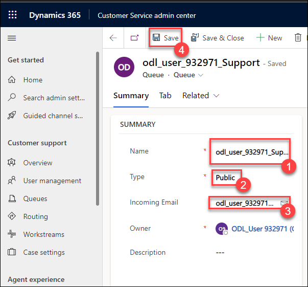

1.  Click **+ New**.

1.  Enter **odl_user_DID_Bronze (1)** for **Name** and select **Private (2)** for **Type**.

1.  Click **Save (3)**.

     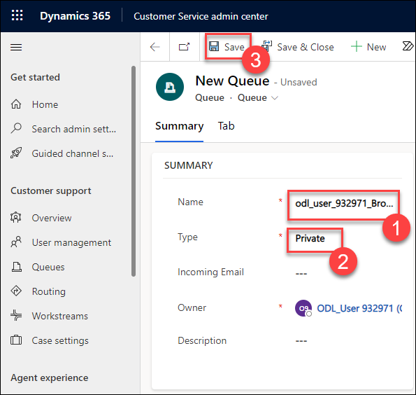

1. Click **+ New (1)**.

1. Enter **odl_user_DID_Silver (2)** for **Name** and select **Private (3)** for **Type**.

1. Click **Save (4)**.

    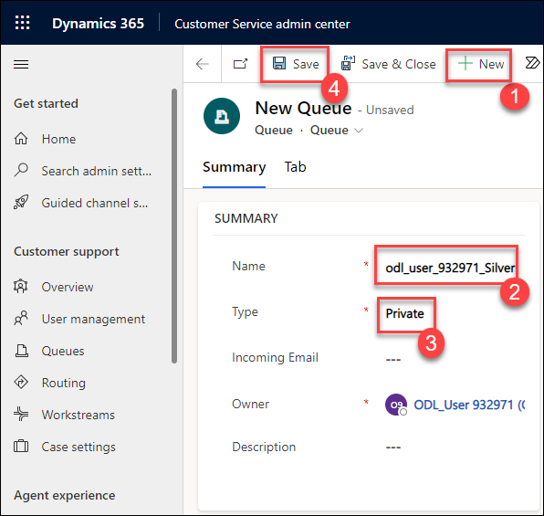

1. Click **+ New (1)**.

1. Enter **odl_user_DID_Gold (2)** for **Name** and select **Private (3)** for **Type**.

1. Click **Save (4)**.

    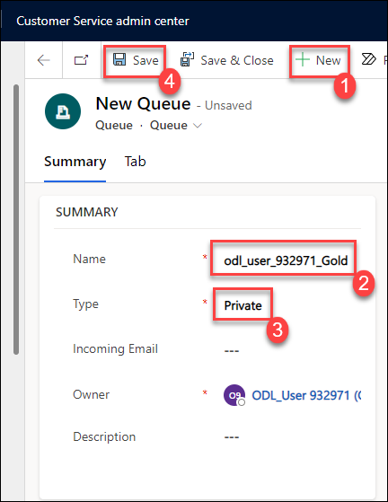

1. Click on **Queues (1)** in the **Customer support** section and then click on **Manage (2)** from right side.

    

1. Select the **My Active Queues** view.

1. You should now see a private queue that was created for your user automatically, the public queue, and three private queues that you created in this lab.

    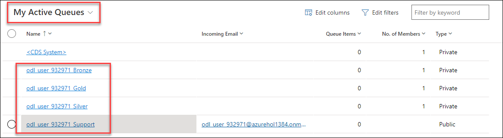

1. Navigate back to the previous **services** tab of **Customer Services Hub**.

1. On the services page, refresh the page and Click **Queues** under the **Service** section.

1. Change the view from **Items I am working on** to **All items**

    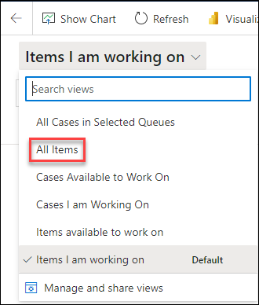

1. Review the options in the list for **Queues I'm a member of**. You should be able to see the four queues you created.

    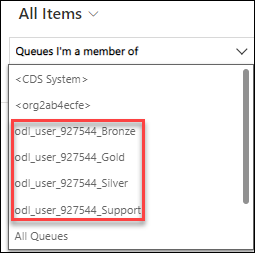
    
> **Congratulations** on completing the task! Now, it's time to validate it. Here are the steps:
> - Select the **Lab Validation** tab located at the upper right corner of the lab guide section.
> - Hit the Validate button for the corresponding task. If you receive a success message, you can proceed to the next task. 
> - If not, carefully read the error message and retry the step, following the instructions in the lab guide.
> - If you need any assistance, please contact us at labs-support@spektrasystems.com. We are available 24/7 to help you out.

### Task 2 – Add cases to queues

1.  Open the **Customer Service Hub** app.

1.  Click on **Cases (1)** in the **Service** section of the sitemap.

1.  Select the **odl_user_DID_Service Required (2)** case you created in the earlier lab.

1.  Click **Add to Queue (3)** located on the command bar.

    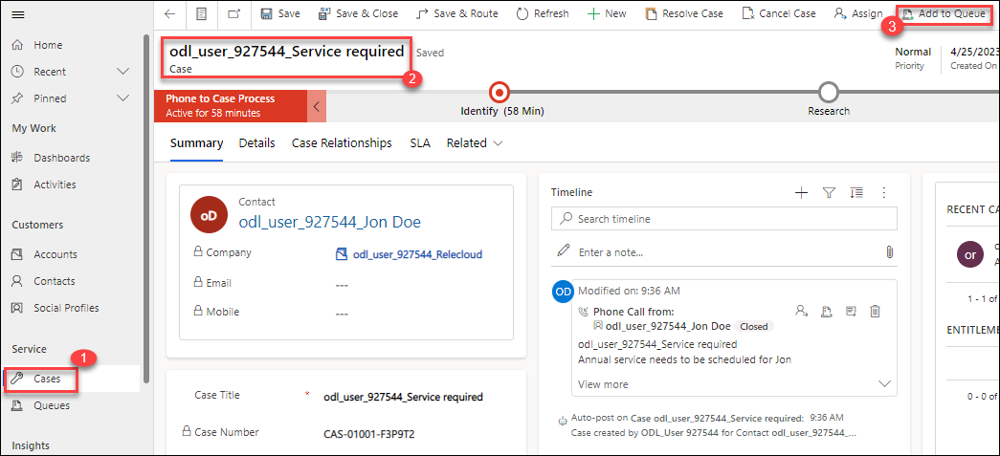

1.  Enter *your prefix ex. odl_user_DID* in the **Queue** field, click on the lookup icon and select the **Bronze** queue you created in the task

1.  Click **Add**

    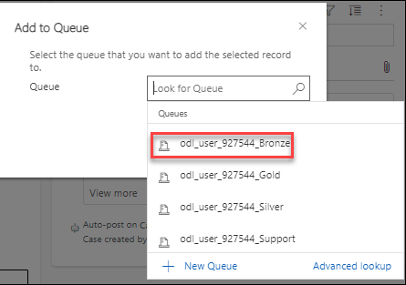

1.  Click on **Cases** in the **Service** section of the sitemap.

1.  Select the **odl_user_DID_Defective Screen** case you created in the earlier lab.

1.  Click **Add to Queue** located on the command bar.

1. Enter *your prefix ex. odl_user_DID* in the **Queue** field, click on the lookup icon and select the **Support** queue you created in the task

1. Click **Add**

    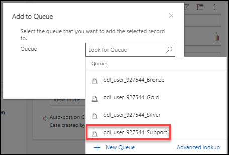

1. Click **Queues** under the **Service** section.

1. Change the view from **Items I am working on** to **All items**

1. You should see the Service Required case listed for the Bronze queue.

1. Change the queue selector from **Queues I'm a member of** to **All Public Queues**.

    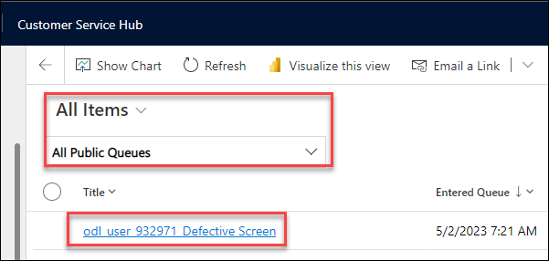

1. You should see the Defective Screen case listed for the Support queue.

1. Change the queue selector to **All Queues**.

    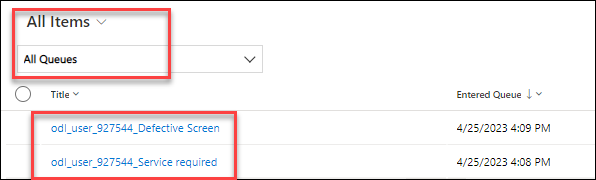
    
> **Congratulations** on completing the task! Now, it's time to validate it. Here are the steps:
> - Select the **Lab Validation** tab located at the upper right corner of the lab guide section.
> - Hit the Validate button for the corresponding task. If you receive a success message, you can proceed to the next task. 
> - If not, carefully read the error message and retry the step, following the instructions in the lab guide.
> - If you need any assistance, please contact us at labs-support@spektrasystems.com. We are available 24/7 to help you out.

### Task 3 – Perform actions on queue items

1.  Click **Queues** under the **Service** section.

1.  Change the view from **Items I am working on** to **Items available to work on**.

1.  Change the queue selector to **Queues I'm a member of**.

1.  You should see the Service Required case listed for the Bronze queue.

1.  Click to the left of the case in the queue to select it.

1.  Click **Queue Item Details** located on the command bar.

1.  Note that **Worked By** is blank.

    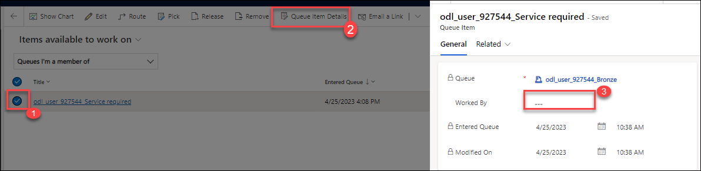

1.  Click **Close** from the three dots.

1.  Click to the left of the case in the queue to select it.

1. Click **Pick** located on the command bar.

    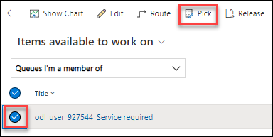

1. Leave the *Also remove the item(s) from the Queue* option set to **No**, and click **Pick**.

1. Change the view from **Items available to work on** to **Items I am working on**.

1. Click to the left of the case in the queue to select it.

1. Click **Queue Item Details** located on the command bar.

1. Note that **Worked By** is set to your user.

    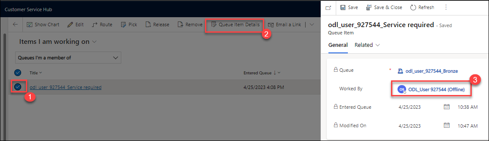

1. Click **Close**

1. Click to the left of the case in the queue to select it.

1. Click **Release** located on the command bar and click **Release**.

    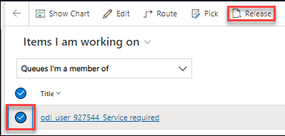
    
**Result:** You have accomplished the creation of queues, inclusion of cases in the queues, and execution of actions on queue items.
