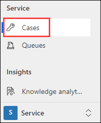
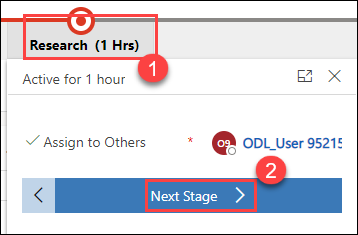
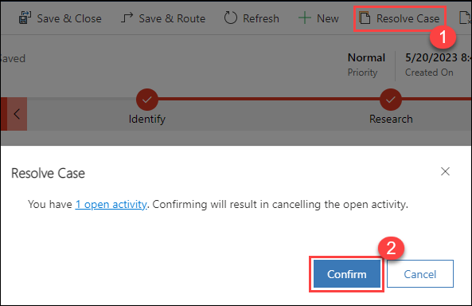
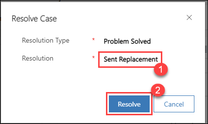
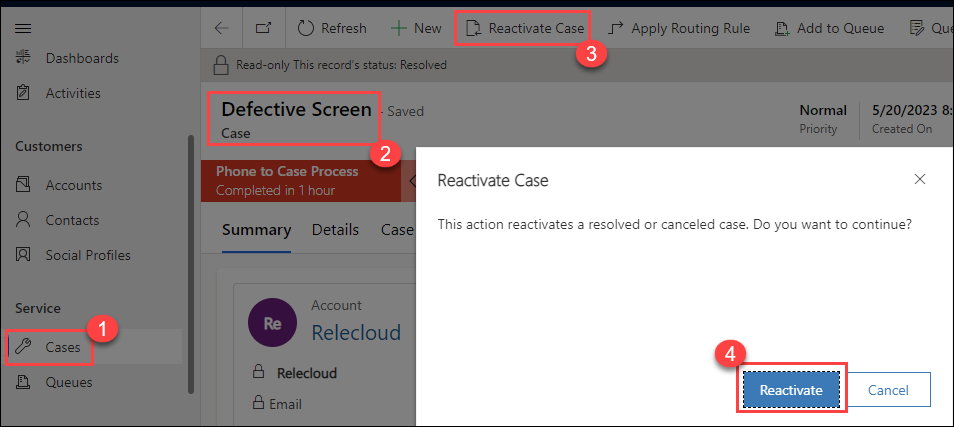
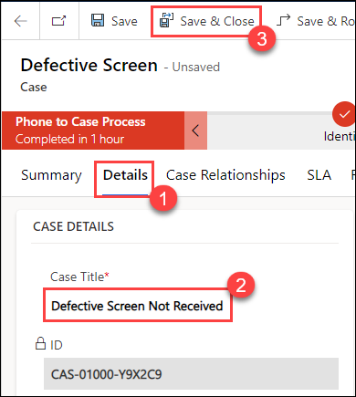

# Practice Lab 3 – Resolving cases

## Scenario

You are a customer service manager at City Power & Light who has been tasked with trying the new case resolution and reactivation functionality before rolling it out to your users. In this lab, you will resolve a case and reactive that case.

## Exercise 1 – Resolve Cases

### Task 1 – Resolve Case

1.  Open the **Customer Service Hub** app.

1.  Click on **Home** at the top of the left-hand side navigation.

1.  Click on **Cases** in the **Service** section of the sitemap.

    

1.  Open the **Defective Screen** case you created.

1.  Click on the **Research (1)** stage of the **Business Process Flow**, then click on **Next Stage (2)**.

    

1.  The **Business process Flow** will advance to the **Resolve** stage. Click on the **Resolve** stage and click **Finish**.

1.  Click on the **Resolve Case (1)** button located in the command bar. Note: You may need to click the ellipsis (...) to see the button.

1. A dialog will be displayed with the message *There are open activities associated with this case. The open activities will be cancelled if you resolve this case. Do you want to resolve the case?*

1. Click **Confirm (2)**.

    

1. Select **Problem Solved** for **Resolution Type** and enter **Sent Replacement (1)** for **Resolution** and click **Resolve (2)**.

    

### Task 2 – Reactivate Resolved Case

1.  Click **Cases (1)** under the **Service** section.

1.  Change the **View** from **My active Cases** to **Resolved Cases**.

1.  Open the case you resolved **Defective Screen** in task 1.

1.  Click on the **Reactivate Case (3)** button located in the command bar. A dialog will be displayed with the message to confirm, select **Reactivate (4)**.

    

1.  Change the **Case Title** to **Defective Screen Not Received (2)** in the **Details (1)** tab and then click on **Save & Close (3)**.

    
    
> **Congratulations** on completing the task! Now, it's time to validate it. Here are the steps:
> - Select the **Lab Validation** tab located at the upper right corner of the lab guide section.
> - Hit the Validate button for the corresponding task. If you receive a success message, you can proceed to the next task. 
> - If not, carefully read the error message and retry the step, following the instructions in the lab guide.
> - If you need any assistance, please contact us at labs-support@spektrasystems.com. We are available 24/7 to help you out.

**Result:** You have successfully resolved the cases in this lab.  
