# Practice Lab 4 – Routing cases

## Scenario

You are a customer service manager at City Power & Light who has been tasked with trying the new case routing functionality before rolling it out to your users. In this lab, you will create record creation rules, and case routing rules and test how they work.

> `Important`: The **[DeploymentId]/[DID] can be found under the environment details tab in the user name (example: `odl_user_xxxxxx.onmicrosoft.com`) **xxxxxx** is the [DeploymentID]**.

## Exercise 1 – Configure record creation rules

### Task 1 – Enable a case to be created from an email in a queue

1.  Click on the **Customer Service Hub** app from the top and select **Customer service admin**.

    
    
1.  Using the navigation on the left, select **Case settings**.

1.  Select **Manage** next to **Automatic record creation and update rules**.

    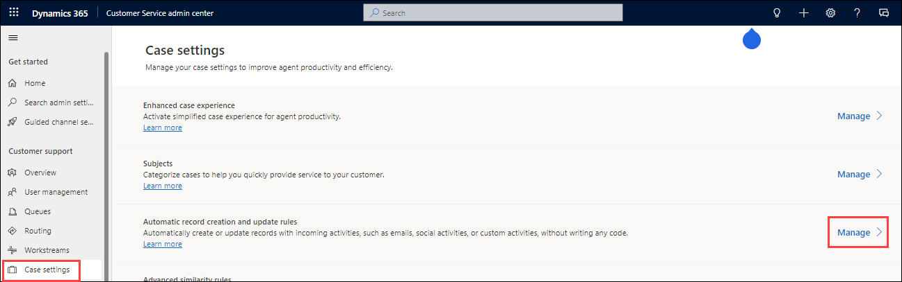

1.  Click **+ New** located on the command bar.

1.  Enter **odl_user_DID_Create_case_for_support_email** for **Rule name**, and select **Email** for **Activity type to monitor**.

1. Select the **odl_user_DID_Support** queue you created for Queue to monitor, and select **Email** for Activity type to monitor.
    
1.  Click **Save**.

    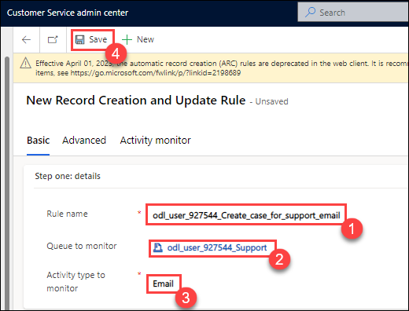

1.  In **Step two: conditions to evaluate and actions to take**, click **+ New**.

1.  Enter **High priority emails** for **Condition name**.

1.  Click on **Add** and then select **Add row** from the drop-down.

1. In the left-hand side of the condition, select **Priority (Email)** from the drop-down.

1. Select **Equals** from the drop-down for the operator.

1. In the right-hand side of the condition, select **High** from the drop-down.

1. Click **Save and open Power Automate**.

    

1. If prompted to connect to Dataverse, click **Continue**.

1. If not Sign-in, then enter following **Email/Username** and then click on **Next**. 
   * Email/Username: <inject key="AzureAdUserEmail"></inject>
   
1. Now enter the following **Password** and click on **Sign in**.
   * Password: <inject key="AzureAdUserPassword"></inject>

1. Expand the **Create a record (don't rename this step)** step.

    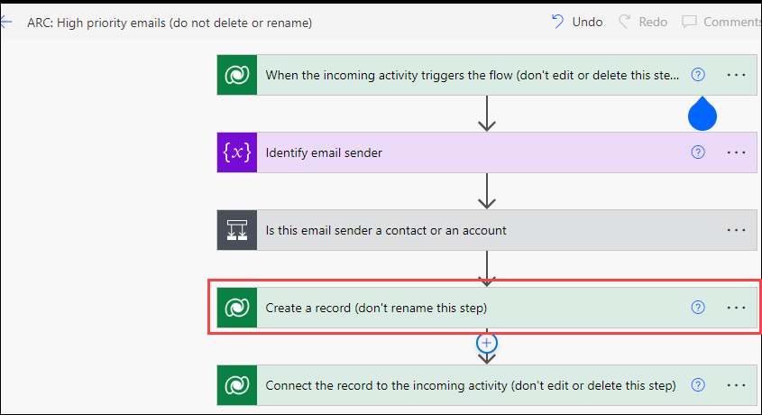

1. Set the **Case Type** to **Request**.

1. Set the **Priority field** to **High**.

1. Click **Save** and close the Power Automate browser tab.

    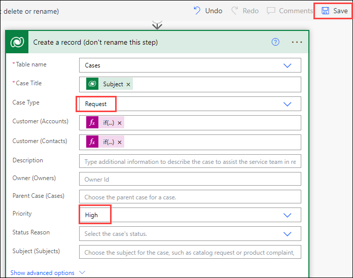

1. Click **Close** in the *Record Creation and Update Rule Item* dialog.

2. In **Step three: additional actions to take after matching with a condition**, set *Automatically reply to email*  to **Yes**.

1. In *Select email template*, search for and select **Case Auto Response**.

1. Click **Save**.

    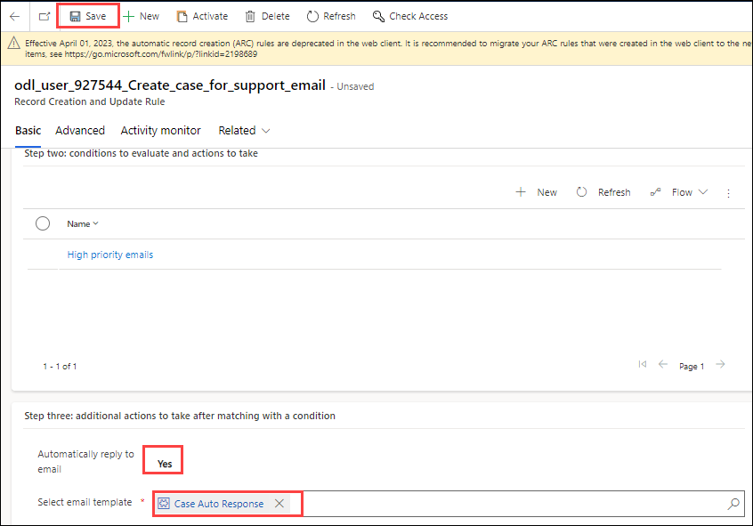

1. Click **Activate**.

1. Click **Activate**.

1. Due to the lack of administrative access to email mailboxes, you will not be able to test this rule.

## Exercise 2 – Basic routing

### Task 1 – Configure basic routing rule set

1.  Click on the **Customer Service Hub** app from the top and select **Customer service admin**.

    
    
1.  Click on **Routing** in the **Customer support** section and then click on **Manage** from right side of the **Basic routing rile sets**.

    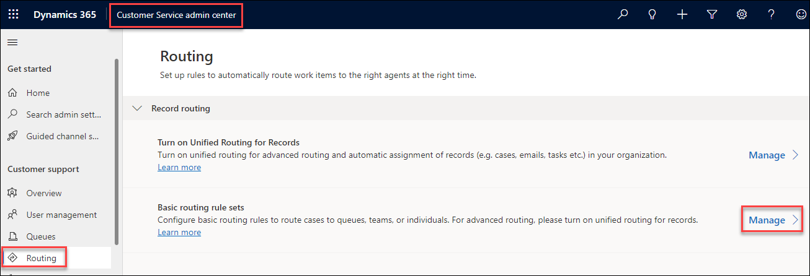

5.  Click **+ New** located on the command bar.

6.  Enter **odl_user_DID_basic case routing rules** for **Name**.

7.  Click **Save**.

    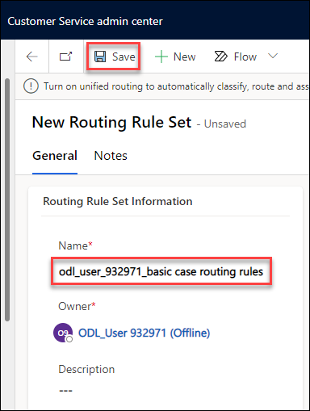

8.  Click **+ New Rule Item**.

    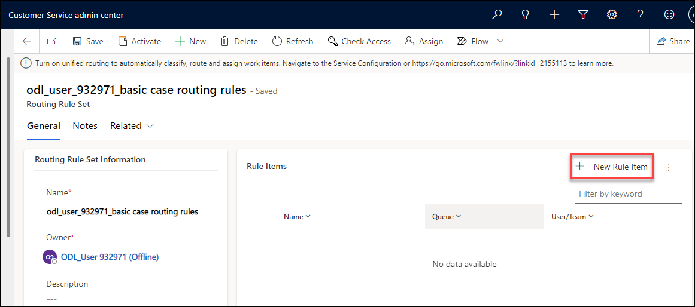

9.  Enter **Problem** for **Name**.

10. Click on **Add** and **Add row**.

    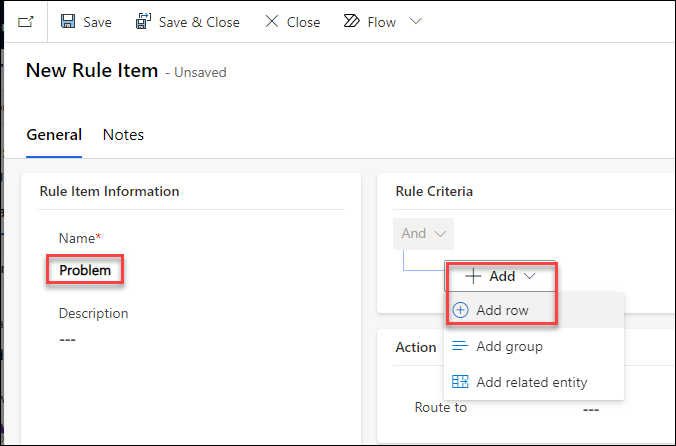

11. In the left-hand side of the condition, select **Case Type (Case)**.

12. Select **Equals** for the operator.

13. In the right-hand side of the condition, select **Problem**.

14. Select **Queue** for **Route To**.

15. Search for and select the **Gold** queue you created in the earlier lab.

16. Click **Save & Close**.

    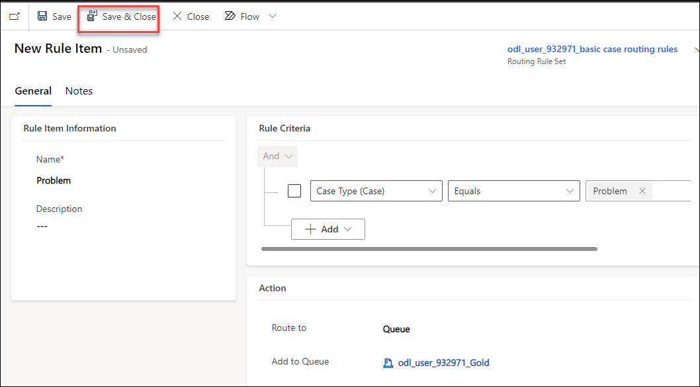

17. Click **+ New Rule Item**.

18. Enter **Maintenance** for **Name**.

19. Click on **Add** and **Add row**.

20. In the left-hand side of the condition, select **Subject (Case)**.

21. Select **Equals** for the operator.

22. In the right-hand side of the condition, select **Service**.

23. Select **Queue** for **Route To**.

24. Search for and select the **Silver** queue you created in the earlier lab.

25. Click **Save & Close**.

    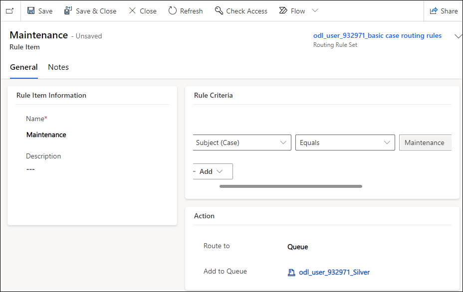

26. Click **+ New Rule Item**.

27. Enter **Questions and Requests** for **Name**.

28. Click on **Add** and **Add row**.

29. In the left-hand side of the condition, select **Case Type (Case)**.

30. Select **Equals** for the operator.

31. In the right-hand side of the condition, select **Question** and select **Request**.

32. Select **Queue** for **Route To**.

33. Search for and select the **Bronze** queue you created in the earlier lab.

34. Click **Save & Close**.

    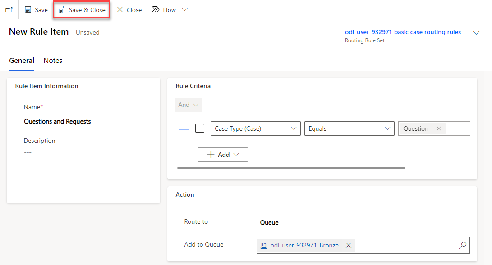

35. Click **Save**.

36. Click **Activate** and click **Yes**.

## Exercise 3 – Route cases

### Task 1 – Route cases

1.  Open the **Customer Service Hub** app.

2.  Click on **Home** at the top of the left-hand side navigation.

3.  Click on **Cases** in the **Service** section of the sitemap.

4.  Enter *your prefix ex. mollyc* in the **Search this view** field, click on the lookup icon.

5.  Open the **Defective Screen** case you created.

6.  Click **Queue Item Details** located on the command bar.

7.  The following message should be displayed *This record is not added to any queue.*

8.  Click **OK**.

9.  Click **Save & Route** and click **Route**.

10. Open the **Defective Screen** case again.

11. Click **Queue Item Details** located on the command bar.

12. The case will be have been routed to the *Gold* queue.

    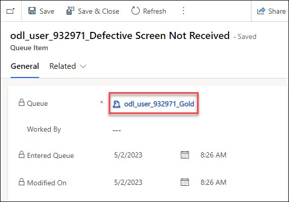

13. In the case view, click to the left of the **Service Required** case to select it.

14. Click **Apply Routing Rule** and click **Route**.

15. Open the **Service Required** case.

16. The case will be have been routed to the *Silver* queue.

    
