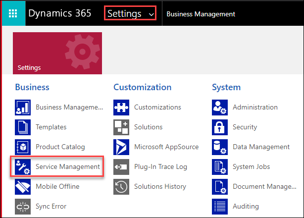
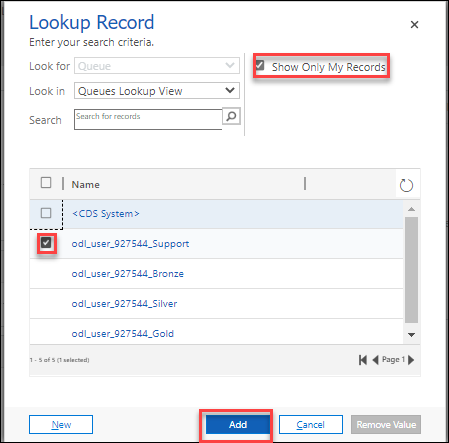
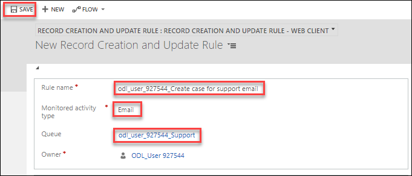
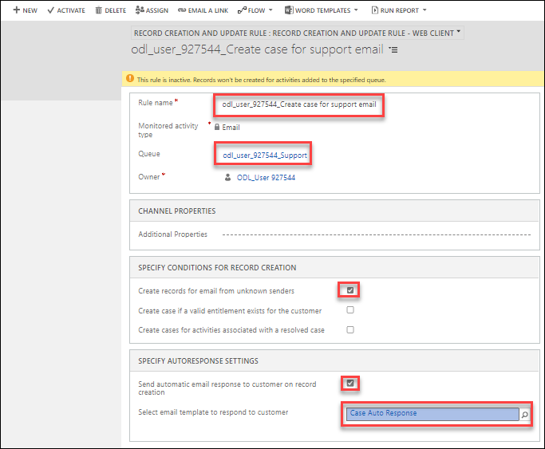
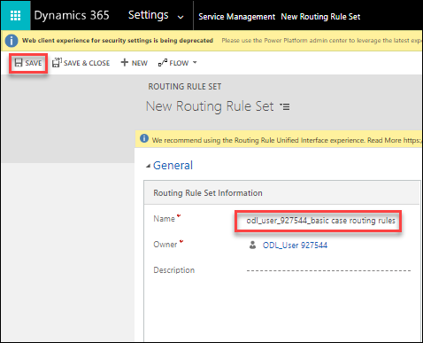
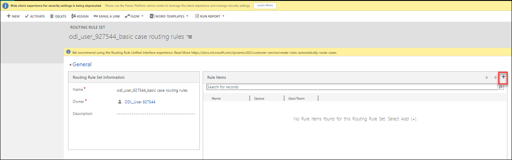
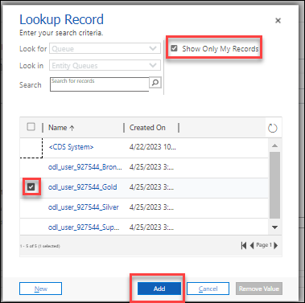

# Practice Lab 4 – Routing cases

## Scenario

You are a customer service manager at City Power & Light who has been tasked with trying the new case routing functionality before rolling it out to your users. In this lab, you will create record creation rules, and case routing rules and test how they work.

## Exercise 1 – Configure record creation rules

### Task 1 – Enable a case to be created from an email in a queue

1.  Open the **Customer Service Hub** app.

2.  Click on **Settings** from the top right corner and select **Advanced settings**.

    
    
3.  On the new page, select the Settings drop down and select **Service Management**.

    

4.  Click on **Automatic record creation and update rules** in the **Case Settings** section.

5.  Click **+ New** located on the command bar.

6.  Enter **odl_user_DID_Create case for support email** for **Rule name**, and select **Email** for **Activity type to monitor**.

7.  Under the Queue list select **Look up more records** and select the check box of **show only my records** and select the **odl_user_DID_support** from the list .
    
    

8.  Click **Save**.

    

9.  Under the **SPECIFY CONDITIONS FOR RECORD CREATION**, select the check box for **Create records for email from unknown senders**.

10. Under the **SPECIFY AUTORESPONSE SETTINGS**, select the check box for **Send automatic email response to customer on record creation**.

11. In *Select email template to resopond to customer*, search for and select **Case Auto Response**.

12. Click **Save**.

13. Click **Activate**.

14. Click **Activate**.

    

15. Due to the lack of administrative access to email mailboxes, you will not be able to test this rule.

## Exercise 2 – Basic routing

### Task 1 – Configure basic routing rule set

1.  Open the **Customer Service Hub** app.

2.  Click on **Settings** from the top right corner and select **Advanced settings**.

    
    
3.  On the new page, select the Settings drop down and select **Service Management**.

    

4.  Click on **Routing Rule Sets** in the **Case Settings** section.

5.  Click **+ New** located on the command bar.

6.  Enter **odl_user_DID_basic case routing rules** for **Name**.

7.  Click **Save**.

    

8.  Click **+ New Rule Item**.

    

9.  Enter **Problem** for **Name**.

10. Select **Queue** for **Route To**.

11. Search for and select the **Gold** queue you created in the earlier lab.

    

12. Click **Save & Close**.

    

13. Click **+ New Rule Item**.

14. Select **Queue** for **Route To**.

15. Search for and select the **Silver** queue you created in the earlier lab.

16. Click **Save & Close**.

17. Click **+ New Rule Item**.

18. Enter **Questions and Requests** for **Name**.

19. Select **Queue** for **Route To**.

20. Search for and select the **Bronze** queue you created in the earlier lab.

21. Click **Save & Close**.

22. Click **Activate** and click **Yes**.

## Exercise 3 – Route cases

### Task 1 – Route cases

1.  Open the **Customer Service Hub** app.

2.  Click on **Home** at the top of the left-hand side navigation.

3.  Click on **Cases** in the **Service** section of the sitemap.

4.  Open the **Defective Screen** case you created.

5.  Click **Queue Item Details** located on the command bar.

6.  The following message should be displayed *This record is not added to any queue.*

7.  Click **OK**.

    

8.  Click **Save & Route** and click **Route**.

9. Open the **Defective Screen** case again.

10. Click **Queue Item Details** located on the command bar.

11. The case will be have been routed to the *Gold* queue.

12. In the case view, click to the left of the **Service Required** case to select it.

13. Click **Apply Routing Rule** and click **Route**.

    

14. Open the **Service Required** case.

15. The case will be have been routed to the *Silver* queue.
