# Practice Lab 5 – Entitlements and SLAs

## Scenario

As a customer service manager at City Power & Light, you need to create entitlements and entitlement templates to manage complex service offerings and guide your team in processing cases from various channels. In this lab, you will create an entitlement with entitlement channels. You will also create an entitlement template and create an entitlement from the template.

> `Important`: The **[DeploymentId]/[DID] can be found under the environment details tab in the user name (example: `odl_user_xxxxxx.onmicrosoft.com`) **xxxxxx** is the [DeploymentID]**.

## Exercise 1 – Entitlements

In this exercise, you will create an entitlement for your user, this entitlement will allow you to create 50 case through Email channel, 30 Cases through Web channel, 10 Cases each for Twitter and Facebook channels.

### Task 1 – Create Entitlement

In this task, you will create an entitlement with 100 total terms for the Relecloud customer.

1.  Open the **Customer Service Hub** app.

2.  Click on **Settings** from the top right corner and select **Advanced settings**.

    
    
3. On the new page, select the Settings drop down and select **Service Management**.

    

4.  Click on **Entitlements** in the **Service Terms** section.

5.  Click **+ New** located on the command bar.

6.  Enter **odl_user_DID_Entitlement 1** for **Name**, select the account you created for **odl_user_DID_Relecloud** in the earlier lab for **Primary Customer**, select today's date for **Start Date**, and select a month from today for **End Date**.

7.  Select **Yes** for **Restrict based on entitlement terms**.

8.  Select **Number of Cases** for **Allocation Type**, select **Case Creation** for **Decrease Remaining On**, and enter **100** for **Total Terms**.

9.  Click **Save**. DO NOT navigate away from the Entitlement form.

    

### Task 2 – Add Channels to the entitlement

In this task, you will add entitlement channels to the default entitlement and then activate the entitlement.

1.  Open the newly created entitlement **odl_user_DID_Entitlement 1** and select **pop out this form** from top right corner.

    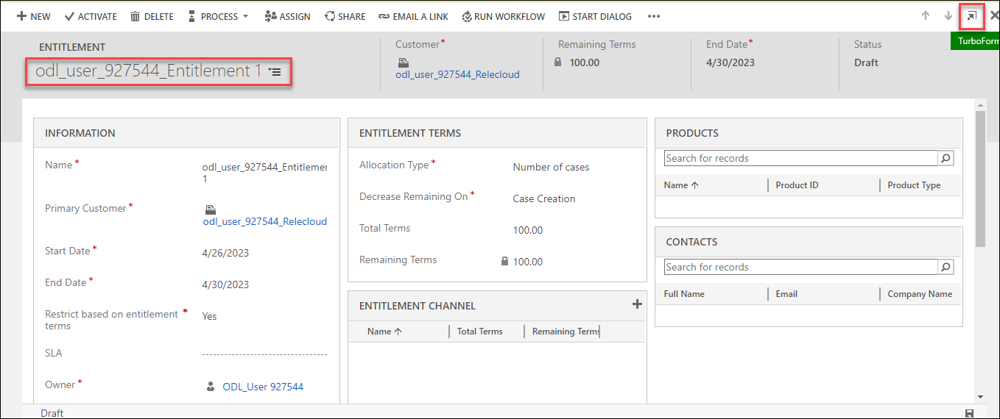

2.  In the **Entitlement Channel** section of the Entitlement form, click on the ellipsis (...) and select **+ New Entitlement Channel**.

    

3.  Select **Email** for **Name**, enter **50** for **Total Terms** and click **Save & Close**.

    

4.  Click on the ellipsis button and select **+ New Entitlement Channel**.

5.  Select **Web** for **Name**, enter **30** for **Total Terms** and click **Save and Close**.

6.  Click on the ellipsis button and select **+ New Entitlement Channel**.

7.  Select **Facebook** for **Name**, enter **10** for **Total Terms** and click **Save and Close**.

8.  Click on the ellipsis button and select **+ New Entitlement Channel**.

9.  Select **Twitter** for **Name**, enter **10** for **Total Terms** and click **Save and Close**.

10.  Click on the ellipsis button and select **+ New Entitlement Channel**.

11. Select **Phone** for **Name**, enter **0** for **Total Terms** and click **Save and Close**.

12. Click on the ellipsis button and select **+ New Entitlement Channel**.

13. Select **IoT** for **Name**, enter **0** for **Total Terms** and click **Save and Close**.

14. Click **Activate**.

    

15. Click **Activate**.

16. Click **Set as Default**.

17. Click **Confirm**.

### Task 3 – Test the Entitlement

In this task, you will test the default entitlement for Relecloud.

1.  Click on **Home** at the top of the left-hand side navigation.

2.  Click on **Cases** in the **Service** section of the sitemap.

3.  Click **+ New Case**.

4.  Enter **odl_user_DID_Audio System Setup Issues** for **Case Title**, select the **odl_user_DID_Relecloud** account you created in the earlier lab for **Customer**, select **Email** for **Origin** and click **Save & Close**. The entitlement should be applied automatically.

    

5.  Click **+ New Case**.

6. Enter **odl_user_DID_Defective Speaker** for **Case Title**, select the **odl_user_DID_Relecloud** account you created in the earlier lab for **Customer**, select **Facebook** for **Origin**, select the **odl_user_DID_Entitlement 1** record you created for **Entitlement** and click **Save & Close**.

    

7.  Click **+ New Case**.

8.  Enter **odl_user_DID_Product Query** for **Case Title**, select the **odl_user_DID_Relecloud** account you created in the earlier lab for **Customer**, select **Phone** for **Origin**, select the **odl_user_DID_Entitlement 1** record you created for **Entitlement** and click **Save**.

    

9. The following message will be displayed, *You can't create a case for this entitlement because there are no available terms.*

    

10. Click **OK**.

11. Scroll to the **Entitlement** field and click on the **odl_user_DID_Entitlement 1**. Click **Discard changes**.

12. Switch back to the **Service management** page opened in the browser and click on the **odl_user_DID_Entitlement 1** createdand refresh the page.

12. Go to the **Entitlement Terms** section and make sure you have **98 Remaining Terms**.

13. Go to the **Entitlement Channel** sub-grid and make sure you have **49 Remaining Terms** for **Email**, **9 Remaining Terms** for **Facebook**, **10 Remaining Terms** for **Twitter**, and **30 Remaining Terms** for **Web**.

    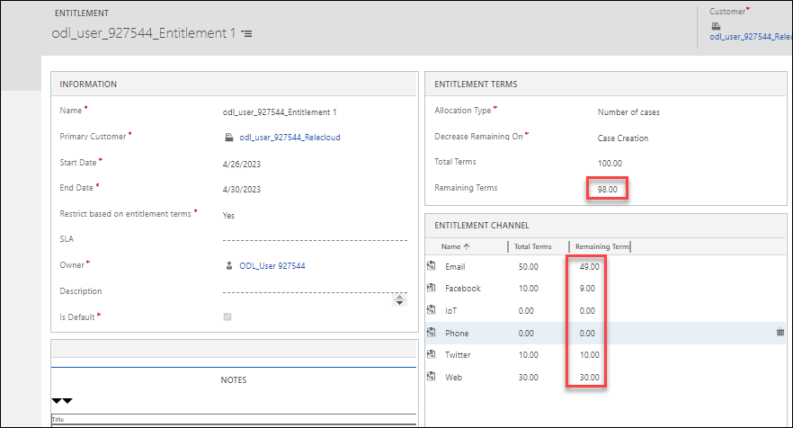

## Exercise 2 – Entitlement Templates

In this exercise, you will create an entitlement template that will have 20 free terms and the customer will be able to select the channel they prefer during the entitlement creation.

### Task 1 – Create Entitlement Templates

In this task, you will create an entitlement template with 20 terms.

1.  Open the **Customer Service Hub** app.

2.  Click on **Settings** from the top right corner and select **Advanced settings**.

    
    
3. On the new page, select the Settings drop down and select **Service Management**.

    

4.  Click on **Entitlements Templates** in the **Templates** section.

5.  Click **+ New** and select **pop out this form** from top right corner.

    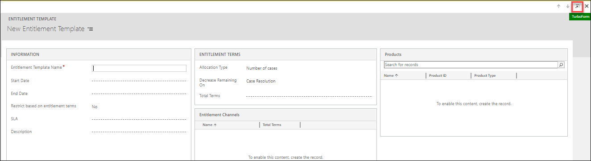

6.  Enter **odl_user_DID_20 Free Terms** for **Entitlement Template Name**, select **Yes** for **Restrict on Entitlement Terms**, select **Number of Cases** for **Allocation Type**, select **Case Creation** for **Decrease Remaining On**, enter **20** for **Total Terms**.

7.  Click **Save**. DO NOT navigate away from this page.

    

8.  Go to the **Entitlement Channel** sub-grid, click on the ellipsis and select **+ New Entitlement Template Channel**.

9.  Select **Phone** for **Name**, enter **20** for **Total Terms** and click **Save & Close**.

10. Click on the ellipsis and select **+ New Entitlement Template Channel**.

11. Select **Email** for **Name**, enter **0** for **Total Terms** and click **Save & Close**.

12. Click on the ellipsis and select **+ New Entitlement Template Channel**.

13. Select **Web** for **Name**, enter **0** for **Total Terms** and click **Save & Close**.

14. Click on the ellipsis and select **+ New Entitlement Template Channel**.

15. Select **Facebook** for **Name**, enter **0** for **Total Terms** and click **Save & Close**.

16. Click on the ellipsis and select **+ New Entitlement Template Channel**.

17. Select **Twitter** for **Name**, enter **0** for **Total Terms** and click **Save & Close**.

18. Click on the ellipsis and select **+ New Entitlement Template Channel**.

19. Select **IoT** for **Name**, enter **0** for **Total Terms** and click **Save and Close**.

    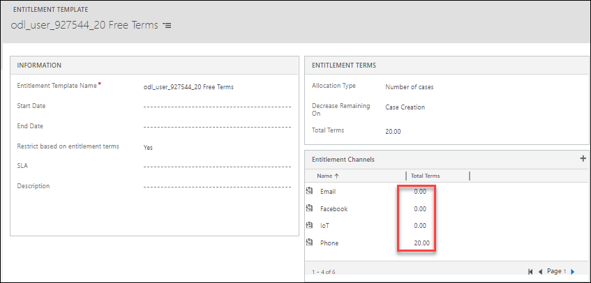

### Task 2 – Create Entitlement from Template

In this task, you will create 20 phone call only entitlement from the entitlement template you created.

1.  Click on **Entitlements** in the **Service Terms** section.

    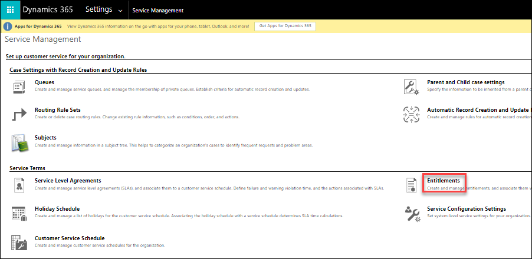

2.  Click on the **V** chevron button next to the **+ New** button and select **From Template**.

    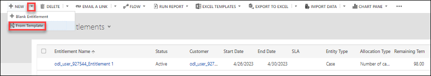

3.  Select **20 Free Terms** template you created for **Entitlement Template** and click **Select**.

4.  Some of the fields will be auto-filled from the template.

5.  Enter **odl_user_DID_Phone Call Only Terms** for **Name**, select the **odl_user_DID_Relecloud** account for **Primary Customer**, select today's date for **Start Date**, select a year from today for **End Date**, and click **Save**.

    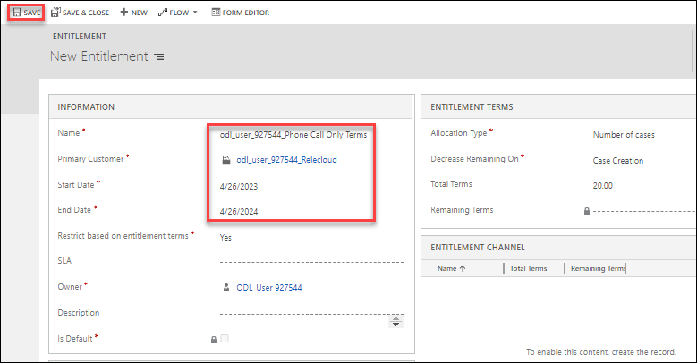

6.  Click **Activate**.

7.  Confirm activation.

### Task 3 – Test the Entitlement

In this task, you will test the entitlement you created from the entitlement template.

1.  Click on **Home** at the top of the left-hand side navigation.

2.  Click on **Cases** in the **Service** section of the sitemap.

3.  Click **+ New Case**.

4.  Enter **odl_user_DID_Missing Parts** for **Case Title** and select the **odl_user_DID_Relecloud** account for **Customer**.

5.  Select **Phone** for **Origin**, select **Phone Call Only Terms** for **Entitlement** and click **Save**.

    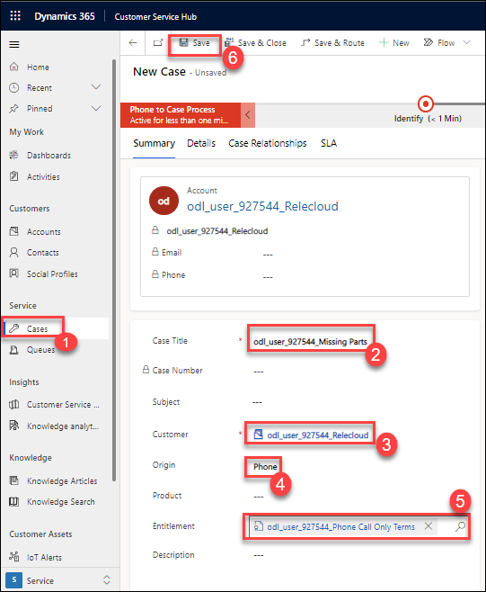

6.  Click **Go back**, click **+ New Case**.

7.  Enter **odl_user_DID_Wrong cables** for **Case Title** and select the **odl_user_DID_Relecloud** account for **Customer**.

8.  Select **Web** for **Origin**.

9.  Scroll down to the **Entitlement** field and select **Phone Call Only Terms**.

10. Click **Save**. You will get an error telling you that there are no available terms.

11. Click **OK**.

    

12. You should get the same error if you select Email, Facebook or Twitter for Origin.

13. Select **Web** for **Origin** and clear the **Entitlement** field.

14. Click **Save**.

15. Since you didn’t select the **Phone Call Only Terms** entitlement, the case will now be created.

16.  Open the **Customer Service Hub** app.
17.  Click on **Settings** from the top right corner and select **Advanced settings**.

    
    
18. On the new page, select the Settings drop down and select **Service Management**.

    

19. Click on **Entitlements** in the **Service Terms** section.

20. Click to open the **Phone Call Only Terms** entitlement.

21. Make sure you have **19 Remaining Terms** and **19 Phone** channel **Remaining Terms**.

    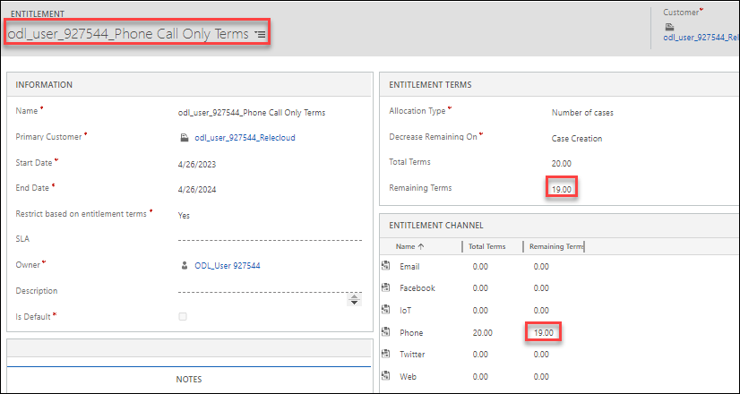

## Exercise 3 – Service Level Agreements

In this exercise, you will create a Service Level Agreement and make it the default agreement.

### Task 1 – Holiday Schedule

In this task, you will create A holiday schedule to be used with Customer Service calendars.

1.  Open the **Customer Service Hub** app.

2.  Click on **Settings** from the top right corner and select **Advanced settings**.

    
    
3. On the new page, select the Settings drop down and select **Service Management**.

    

4.  Click on **Holiday Schedule** in the **Service Terms** section.

5.  Click **+ New**.

6.  Enter **odl_user_DID_Holidays** for **Name**.

7.  Click **Create**. If a pop-up appears stating "service-level agreements (SLAs) are deprecated in the web client" Click **I acknowledge**.

8.  In the Holidays section, click **+ New**.

9.  Enter **Local festival** for **Name**, set the **Start Date** and **End Date** to be in two days time.

10. Click **OK**.

    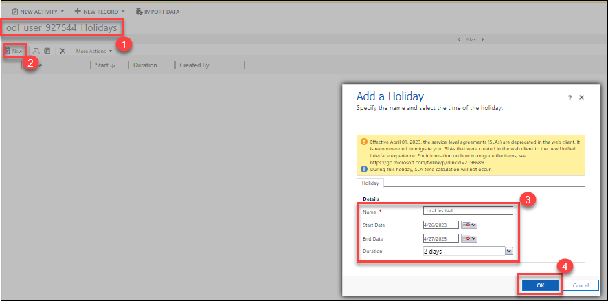

11. Click **Save & Close**.

### Task 2 – Customer Service Schedule

In this task, you will create a Customer Service Schedule to use with SLAs.

1.  Open the **Customer Service Hub** app.

2.  Click on **Settings** from the top right corner and select **Advanced settings**.

    
    
3. On the new page, select the Settings drop down and select **Service Management**.

    

4.  In the **Customer Service Hub** app. Click on **Customer Service Schedule** in the **Service Terms** section.

5.  Click **+ New**.

6.  Enter **odl_user_DID_Customer Service Schedule** for **Name**.

7.  Click **Create**.

8.  Uncheck **Saturday** and **Sunday**.

9.  Click **Set Work Hours**.

10. Set Start to **9:00AM** and End to **5:00PM**.

11. Click **OK**.

12. Set **Holiday Schedule** to **Observe** and select the Holiday Schedule you created.

13. Select your local **Time Zone**

14. Click **Save & Close**.

    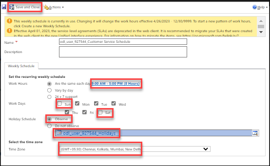

### Task 3 – Create Service Level Agreement

In this task, you will create a SLA that sets a 1 hour response time on a problem case.

1.  Open the **Customer Service Hub** app.

2.  Click on **Settings** from the top right corner and select **Advanced settings**.

    
    
3. On the new page, select the Settings drop down and select **Service Management**.

    

4.  In the **Service Management** app, click on **SLA** in the **Service Terms** section.

    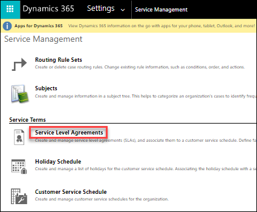

5.  Click **+ New**.

6.  Enter **Trial** for **Name**.

7.  Select **Case** for **Entity Name** and click Ok.
    
8.  Open the newly created SLA **odl_user_DID_Case Response By** and select **pop out this form** from top right corner.

9.  Enter **odl_user_DID_SLA** for **Name**.

10. Select **Case** for **Primary Entity**.

11. Click **Save**.

12. Click **+ New SLA Item** from right side of the page.

13. Enter **Problems** for **Name**.

14. Select the **+ SLA KPI** from the check box.

15. Enter **odl_user_DID_Case Response By** for **Name**.

16.  Select **Case** for **Entity Name**.

17.  Select **First Response By KPI** for KPI FIeld.

18.  Select Created On for Applicable From.

19.  Click **Save and close**.

20. Select the **Customer Service Schedule** you created for **Business Hours**.

21. Under **Applicable When**, click on **Add** and **Add row**.

22. In the left-hand side of the condition, select **Case Type (Case)**.

23. Select **Equals** for the operator.

24. In the right-hand side of the condition, select **Problem**.

25. Under **Success Conditions**, click on **Add** and **Add row**.

26. In the left-hand side of the condition, select **First Response Sent (Case)**.

27. Select **Equals** for the operator.

28. In the right-hand side of the condition, select **Yes**.

29. Set **Warn After** to **45 minutes**.

30. Set **Failure After** to **1 hour**.

31. Click **Save**.

    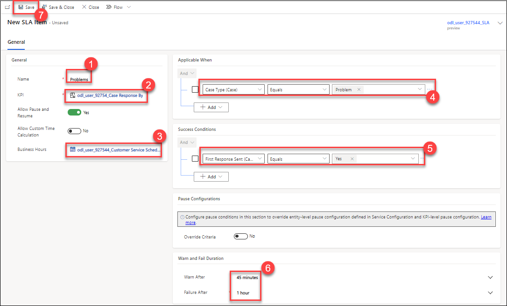

32. Click **Configure Actions**

33. If prompted to connect to Dataverse, click **Continue**.

    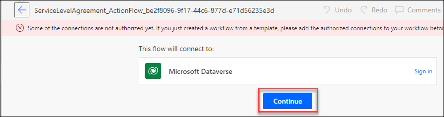

34. Expand the **Switch** step.

35. In the **Non-compliant** path, click on **Add an action**.

36. Search for an select **Microsoft Dataverse**.

37. Select the **Update a row** action.

38. Select **Cases** for **Table name**.

39. Select **Regarding ID** for **Row ID**.

40. Click **Show Advanced options**.

41. Set **Is Escalated** to **Yes**.

42. Click **Save** and close the Power Automate browser tab.

43. Click **Close** in the *SLA Item* dialog.

44. Click **Save**.

45. Click **Activate**.

46. Click **Activate**.

47. Click **Set As Default**. Click **OK** in the **Change default SLA** pop-up.

### Task 4 – Service Level Agreement settings

In this task, you will configure the settings for service level agreements.

1.  Open the **Customer Service Hub** app.

2.  Click on **Settings** from the top right corner and select **Advanced settings**.

    
    
3. On the new page, select the Settings drop down and select **Service Management**.

    

4.  In the **Customer Service Hub** app, click on **Service Configuration Settings** in the **Service Terms** section.

5.  Verify that the **Disable SLAs** option is set to **No**.

6.  Set the **Apply SLA after manual override** to **Yes**.

7.  In **Select SLA Pause Status**, move **On Hold** and **Waiting for Details** from **Available** to **Selected**.

8.  Click **OK**.

    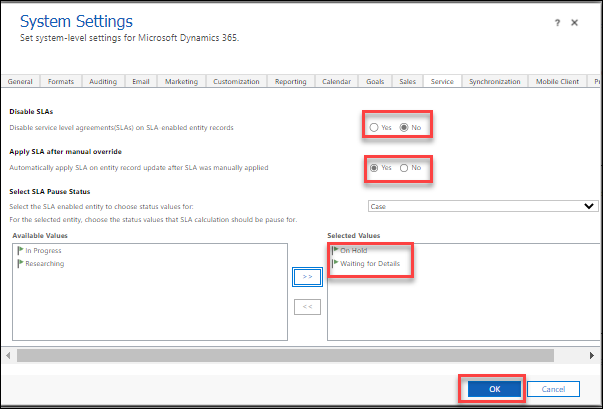

### Task 5 – Test Service Level Agreements

In this task, you will test that the SLA is applied to cases.

1.  Click on **Home** at the top of the left-hand side navigation.

2.  Click on **Cases** in the **Service** section of the sitemap.

3.  Click **+ New Case**.

4.  Enter **odl_user_DID_SLA Test #1** for **Case Title** and select the **odl_user_DID_Relecloud** account for **Customer**.

5.  Select **Web** for **Origin** and click **Save**.

    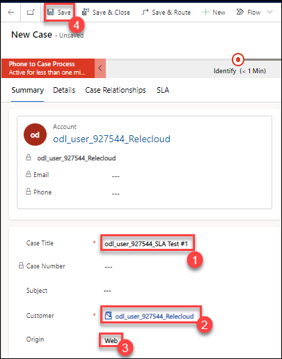

6.  Select the **SLA** tab. You should see the Case Response By SLA KPI in progress with failure time set to 1 hour's time.

7.  Select the **Details** tab and set **First Response Sent** to **Yes** and click **Save**.

8.  Select the **SLA** tab. You should see the Case Response By SLA KPI with status on **Succeeded**.

9.  Click **Go back**, click **+ New Case**.

10. Enter **odl_user_DID_SLA Test #2** for **Case Title** and select the **odl_user_DID_Relecloud** account for **Customer**.

11. Select **Email** for **Origin** and click **Save**.

12. Select the **SLA** tab. There should be no SLA KPI items.
