# Practice Lab 7 – Customer Voice

## Lab scenario

You are a customer service manager at City Power & Light who has been tasked with trying the new Customer Voice functionality to capture feedback on cases before rolling it out to your customers.

## Lab objectives
+ Exercise 1: Create survey
+ Exercise 2: Send survey

## Estimated time: 20 minutes
  
## Exercise 1: Create survey

In this exercise, you will create a project and use a template to create a survey.

### Task 1: Create project

1.  Navigate to <https://customervoice.microsoft.com>

1. If not Sign-in, then on the **Sign into Microsoft Azure** tab you will see the login screen, in that enter following **Email/Username** and then click on **Next**. 
   * Email/Username: <inject key="AzureAdUserEmail"></inject>
   
    
    
1. Now enter the following **Password** and click on **Sign in**.
   * Password: <inject key="AzureAdUserPassword"></inject>

1. If you see the pop-up **Action Required** page, select **Ask Later**.

1.  Click **+ New project**.

1.  Select the **Support** template from the list.

    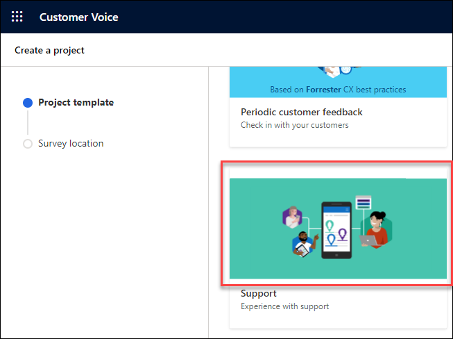

1.  Click **Next** to get Survey location page.

1. Select **See all environments** from the recent locations.

    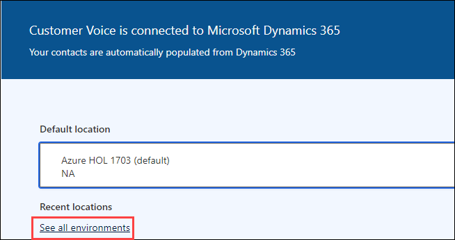

1.  Select the **Prod-Env (1)** Dynamics 365 environment and click on **select and close (2)**.

    

1.  Click **Create**.

1.  Click on **All Projects (1)**

1.  Click on the **ellipsis (2)** next your project and select **Rename (3)**.

    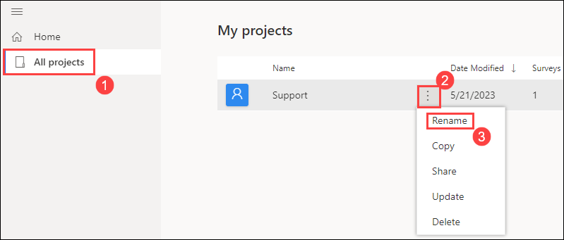

1.  Enter **Case Feedback** and click on **Rename**.

### Task 2: Customize survey

1.  Select your project.

2.  Click in the **Header** and change **Customer Service feedback** to **How did we do?**

3.  Hover the mouse over the header and click on the **Theme color** icon and change name inside HEX# box to **ffdd66**.

    

4.  Hover the mouse over the header and click on the **Image** icon and choose one of the images from the gallery.

    

5.  Select question 1 and set as **Required**.

    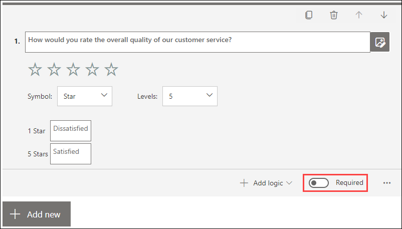

6.  Select question 2 and set as **Required**.

7.  Select the last question in the survey and click on **+ Add new (1)** and click on the **chevron(V)(2)** and select the **Net Promoter Score (3)** question type. Set the question as **Required (4)**.

    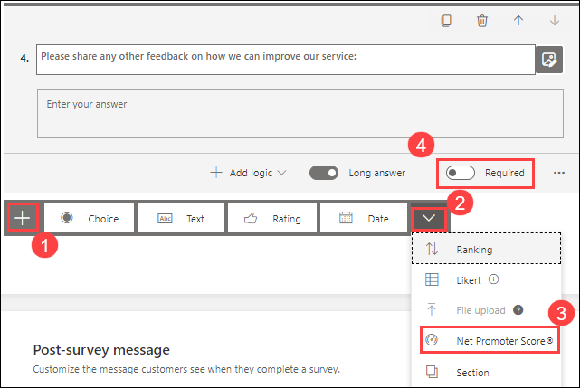

8.  Click on **Post-survey message** and change the Heading from *Thanks!* to **Thank you for your feedback (1)** and change the Message to **We look at all feedback to improve our service (2)**. 

    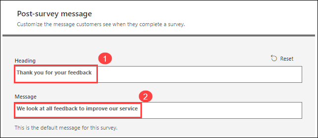

9.  Click in the Footer and enter **The feedback you submit will not be shared outside of the company.**

    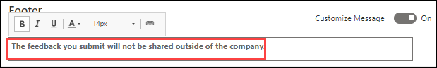

10. Expand **Customization** and select **Personalization**.

11. Click + **Add variable (1)** and enter **casereference (2)** with default value **Your support case (3)**.

12. Click **Save (4)**.

    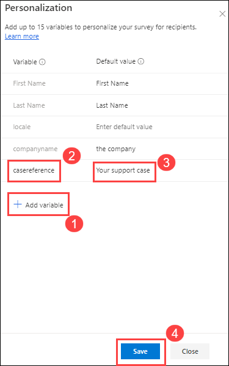

13. Click **Close**.

14. Select **Formatting** from **Customization**.

15. Toggle **Progress bar** to **Off** and close the formatting pane.

    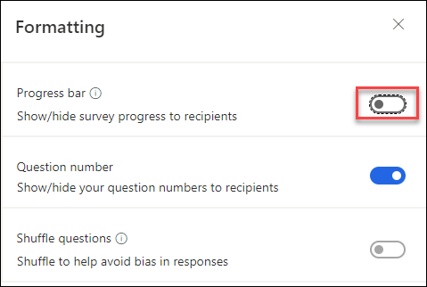

16. Click into the **section header (1)** and clear the text *Input your title here*, click on the **variables (2)** drop down and select **casereference (3)**.

    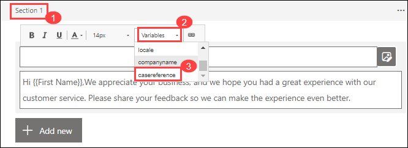

17. Add the text **has been resolved (1)** into the brackets.

    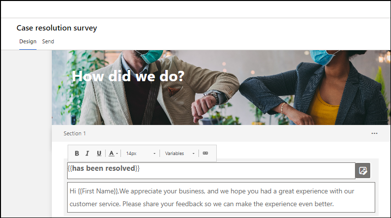

18. Click **Preview (2)**.

    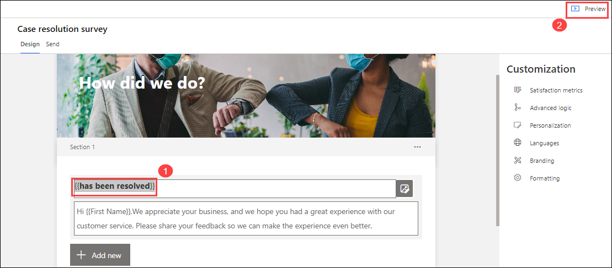

19. Click **Back**.

### Task 3: Satisfaction metrics

1. Select your **project (1)** from the left panel.

1. Expand **Customization** and select **Satisfaction metrics (2)**.

   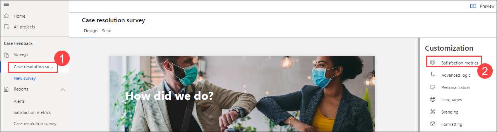

1. Click **+ Add metric (1)**

1. Select **CSAT (2)** from the list.

   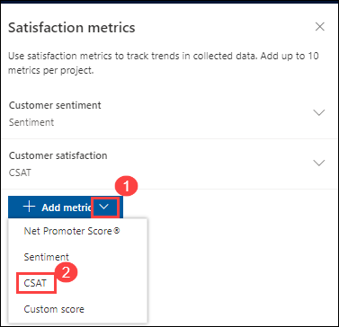

1. Select the **first question (1)**.

1. Click **Save (2)**.

   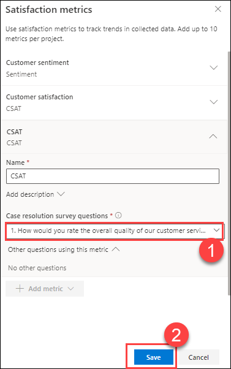

1. Click **+ Add metric**.

1. Select **Net Promoter Score** and select the **last question (1)**.

1. Click **Save (2)**.

   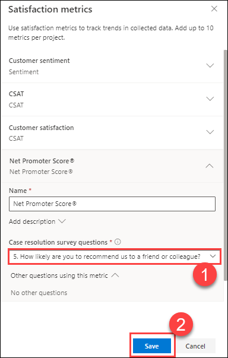

1. Click **+ Add metric**

1. Select **Sentiment** and select the **text question (1)**.

1. Click **Save (2)**.

   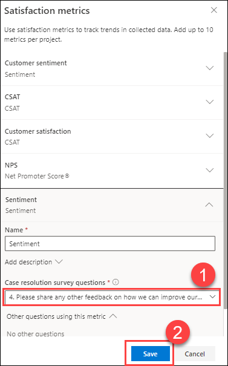

## Exercise 2: Send survey

In this exercise, you will create an email template and send the survey by email.

### Task 1: Configure email template

1. Navigate to <https://customervoice.microsoft.com>

2. Select your **project (1)** from the left panel.

3. Click on the **Send (2)** tab.

4. Click on the **Email (3)** tile.

   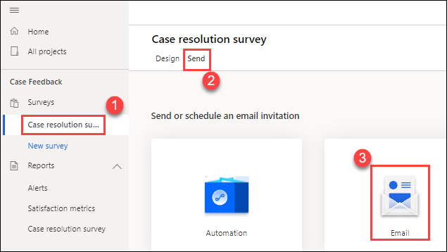

5. Click on the **Template (1)** drop-down and select **Create new (2)**.

   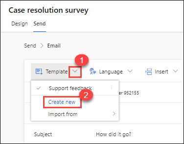

6. Enter **Case Resolution (1)** and click **Add (2)**.

   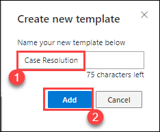

7. Click on the **Insert (1)** drop-down and select **First question in survey (2)**.

   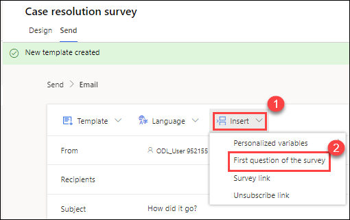

8. Replace the subject line with **Please provide feedback on (1)**, click on the **Insert (2)** drop-down and select **Personalized variables (3)** and then select **casereference (4)**.

   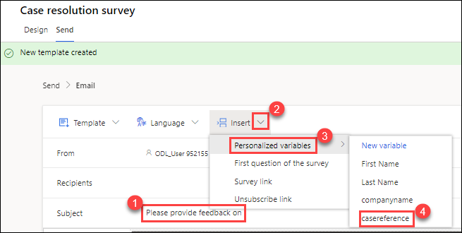

9. Click **Save**.

10. Click **Cancel**.

    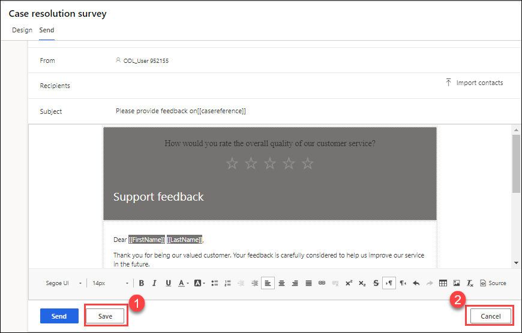

### Task 2: Send the survey

1. Click on the **Send** tab.

2. Click on the **Email** tile.

3. Click on the **Template** drop-down and select the **Case Resolution** template you created.

4. Click in the **Recipients field (1)** and enter **customer@contosot.com**.

5. Click **Send (2)**

     

## Exercise 3: Send survey when a case is resolved

In this exercise, you will use Power Automate to send a survey when a case is resolved.

### Task 1: Configure automation

1. Navigate to <https://customervoice.microsoft.com>

2. Select your project from the left panel.

3. Click on the **Send** tab.

4. Click on **Resend (1)** and select **Automate (2)**.

   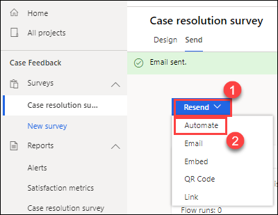

5. Select the **Send a survey when a case is resolved in Dynamics 365** template. You may need to click on **See more templates**.

   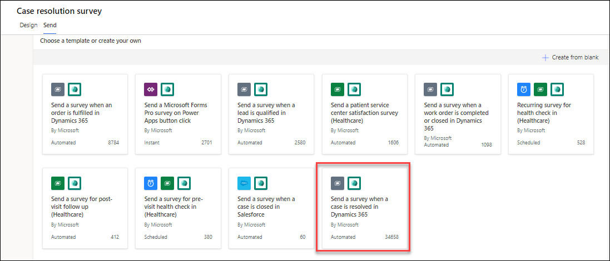

6. If the connections require action, click **Fix connection** and sign in when prompted.

7. Click **Continue**.

   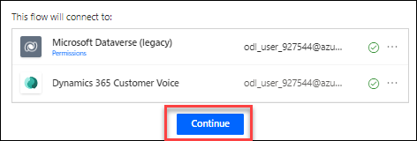

8. On **Case resolution survey** page, follow the below instructions:

     - Microsoft Dataverse (legacy) Environment: Enter **Prod-Env**
     - Dynamics 365 Customer Voice Project: Select **Case Feedback (2)**
     - Dynamics 365 Customer Voice Survey **How did we do?**
     - Dynamics 365 Customer Voice Email template **Support Feedback**

      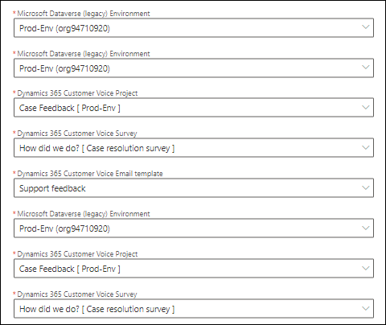

9.  Click **Create**.

     

10. Navigate to <https://flow.microsoft.com> this portal.

11. Sign in with your Dynamics 365 tenant credentials.

12. Switch to the **Prod-Env (1)** Dynamics 365 environment.

13. Click on **My flows (2)**

    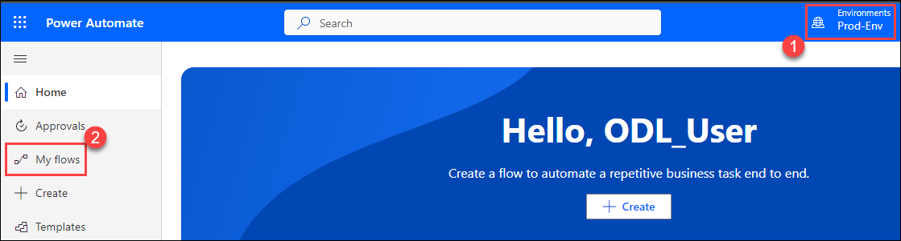

14. Select the **Send a survey when a case is resolved in Dynamics 365** flow and click **Edit**.

    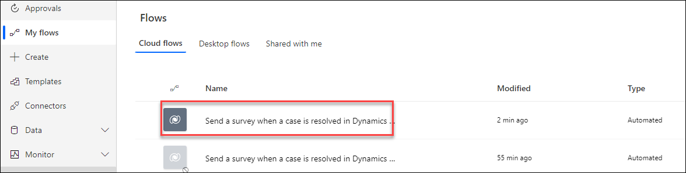

15. Expand the steps in the flow and select the **This action sends a survey to a specified list of recipients**.

    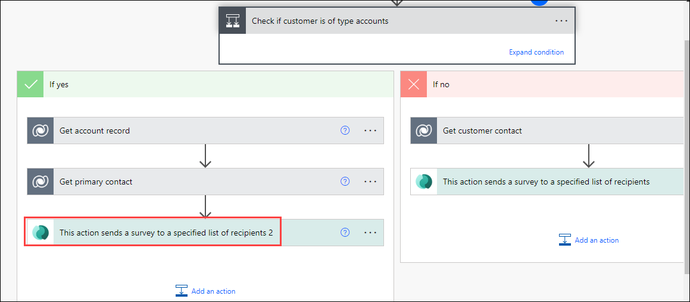

16. Clear the **Email template (1)** field and select the **Case Resolution** template you created.

17. Click **Save (2)**.

    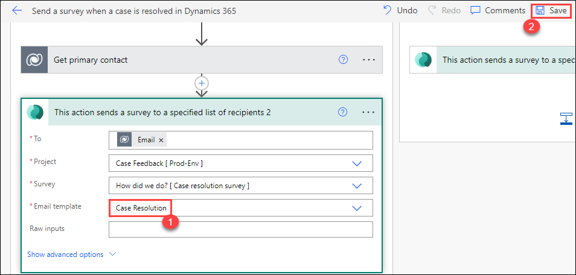

**Result:** You have successfully created the survey and Sent survey when a case is resolved. 

### Review
In this lab, you have completed:
- Creating a project and use a template to create a survey
- Created an email template and send the survey by email.
- Used Power Automate to send a survey when a case is resolved.

### Proceed with the next Lab.
