# Practice Lab 8 – Customer Service Scheduling Configuration

## Scenario

You are the scheduling manager at City Power & Light who has been tasked with setting up the new Service Scheduling functionality to perform services for customers at three of your locations.

> `Important`: The **[DeploymentId]/[DID] can be found under the environment details tab in the user name (example: `odl_user_xxxxxx.onmicrosoft.com`) **xxxxxx** is the [DeploymentID]**.

## Exercise 1: Configure Customer Service Scheduling

In this exercise, you will create organizational units, define a business closure, and create facility/equipment records for organization units.

### Task 1: Define Organization Units

In this task, you will define three organizational units to act as service locations for scheduling.

1.  Open the **Customer Service Hub** app.

2.  Click **Settings** and select **Personalization Settings**.

    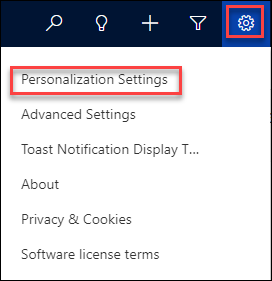

3.  Select your **Time Zone** and click **OK**.

4.  Switch back to the **Power Platform admin center** tab and select the **Prod-Env-DID**.

    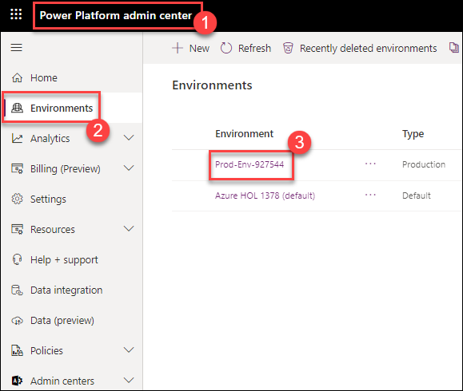

5.  Click on **Settings** at the top of the command bar and select **User + permissions** drop down.

6.  Click on **Business Units** from the list.

    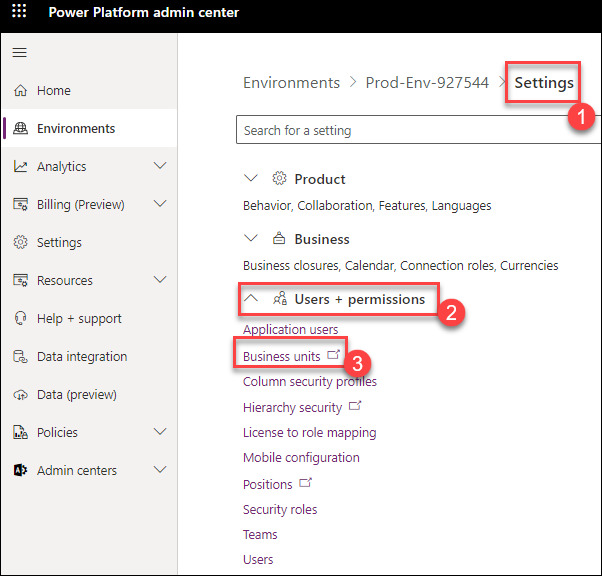

7.  Click **+ New** from the new tab opened.

8.  Enter **odl_user_DID_Main_Ave_Location** for **Name**.

9.  Click **Save and Close**.

    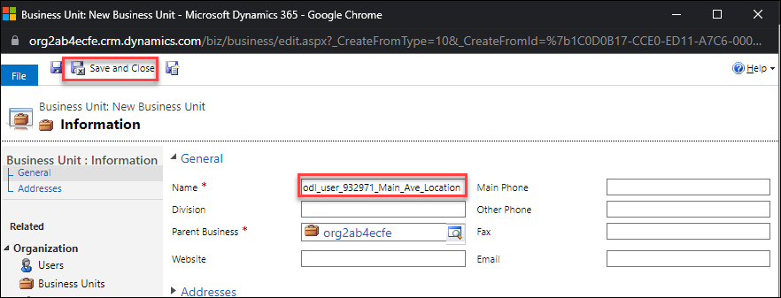

10. Create two more **Sites** with the values listed in the table below.

     odl_user_DID-19th_Ave_Location

     odl_user_DID-35th_St_Location 

11. You should now have three Sites.

    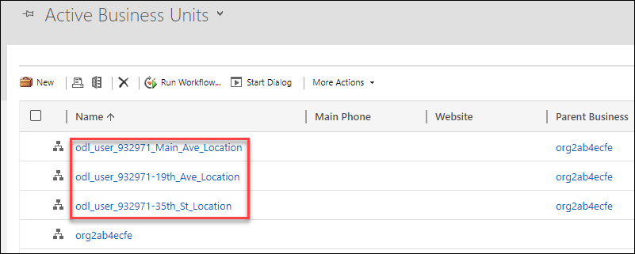

## Task 2: Define Business Closure

In this task, you will define a new business closure.

1.  Switch back to the **Customer Service Hub** app.

1.  Click on **Service** at the bottom of the **Site Map** in the left-hand navigation and select **Scheduling**.

1.  Click on **Business Closures** in the **Settings** section.

2.  Click **+ New**.

    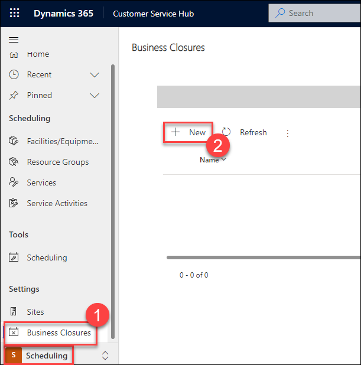

3.  Enter **odl_user_DID_Worldwide_Rest_Day** for **Name**, select a date one week from now for **Start Date**, and click **OK**.

    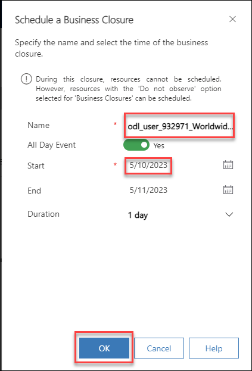

4.  Do not navigate away from this application.

## Task 3: Create Facilities/Equipment Records

In this task, you will create facilities/equipment records for the organizational units you created and set their working hours.

1.  Click on **Facilities/Equipment** in the **Scheduling** section.

2.  Click **+ New**.

    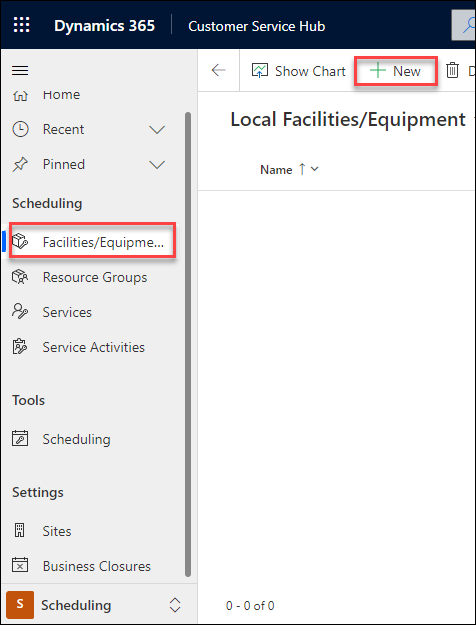

3.  Enter **odl_user_DID_Main_Ave-Service_Bay_1** for **Name**, select **odl_user_DID_Main_Ave_Location** for Business Unit, select a Time Zone*, select the root Business Unit, and click Save.

    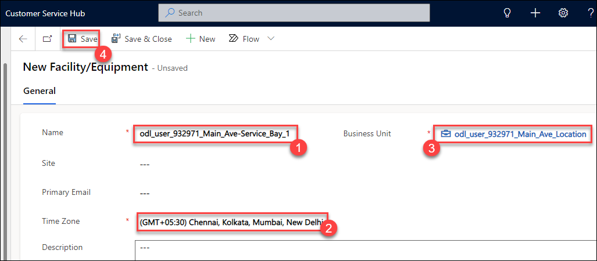

4.  Select the **Work Hours** tab, click on one of the events listed on the calendar, click **Edit**, and select **All events in the series**.

    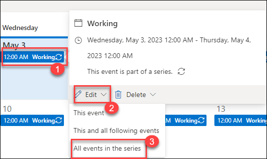

5.  Select **08:00 AM to 08:00 PM**, remove **Saturday** and **Sunday**, and click **Remove end date**, if there is an end date selected.

6.  Toggle **Observe Business Closure** to **On**

7.  Click **Save** to save the working hours.

    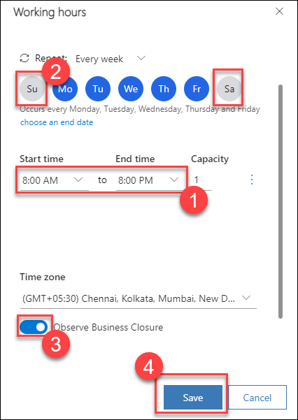

8.  Click **Save and Close**.

9.  Click **+ New**.

10. Enter **odl_user_DID_Main Ave-Service_Bay_2** for **Name**, select **odl_user_DID_Main_Ave_Location** for Business Unit, select your Time Zone, select the root Business Unit, and click Save.

11. Select the **Work Hours** tab, click on one of the events listed on the calendar, click **Edit**, and select **All events in the series**.

12. Select **08:00 AM to 08:00 PM**, remove **Saturday** and **Sunday**, click **Remove end date** if one is selected, and click Save.

13. Toggle **Observe Business Closure** to **On**

14. Click **Save** to save the working hours, and then click **Save and Close**.

15. Repeat the previous 5 steps and create the **Facilities/Equipment** listed in the table below.

| **Name**                                | **Business Unit**                | **Time Zone**  | **Working Hours**        |
|-----------------------------------------|----------------------------------|----------------|--------------------------|
| odl_user_DID_Main_Ave-Tire_Jack         | odl_user_DID_Main_Ave _Location  | Your time zone | Mon-Fri 8:00AM to 8:00PM |
| odl_user_DID_19th Ave-Service_Bay_1     | odl_user_DID_19th_Ave_Location   | Your time zone | Mon-Fri 8:00AM to 8:00PM |
| odl_user_DID_19th_Ave-Service_Bay_2     | odl_user_DID_19th_Ave_Location   | Your time zone | Mon-Fri 8:00AM to 8:00PM |
| odl_user_DID_19th_Ave-Tire_Jack         | odl_user_DID_19th_Ave_Location   | Your time zone | Mon-Fri 8:00AM to 8:00PM |
| odl_user_DID_35th_St-Service_Bay_1      | odl_user_DID_35th_St_Location    | Your time zone | Mon-Fri 8:00AM to 8:00PM |
| odl_user_DID_35th_St-Service_Bay_2      | odl_user_DID_35th_St_Location    | Your time zone | Mon-Fri 8:00AM to 8:00PM |
| odl_user_DID_35th_St-Tire_Jack          | odl_user_DID_35th_St_Location    | Your time zone | Mon-Fri 8:00AM to 8:00PM |

16. You should now have total of 9 Facilities/Equipment records.

    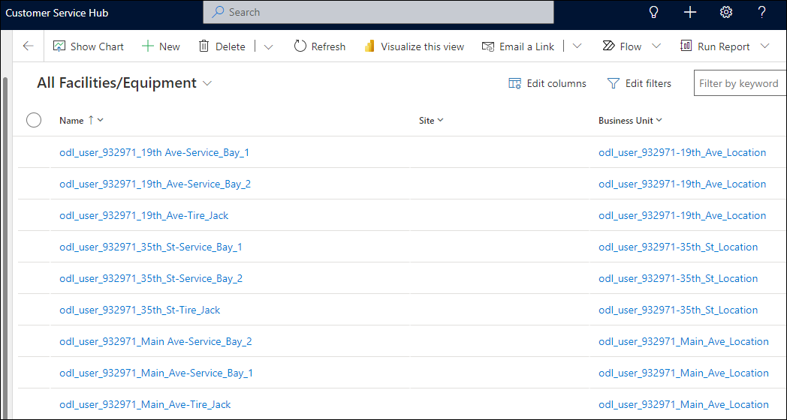

## Exercise 2: Resource Configuration

In this exercise, you will create contact records, create resource categories, and create resources.

### Task 1: Create Contacts

In this task you will create new contact records.

1.  Open the **Customer Service Hub** app.

2.  Click on **Scheduling** at the bottom of the **Site Map** in the left-hand navigation and select **Service**

3.  Click on **Contacts** in the **Customers** section.

4.  Click **+ New**.

    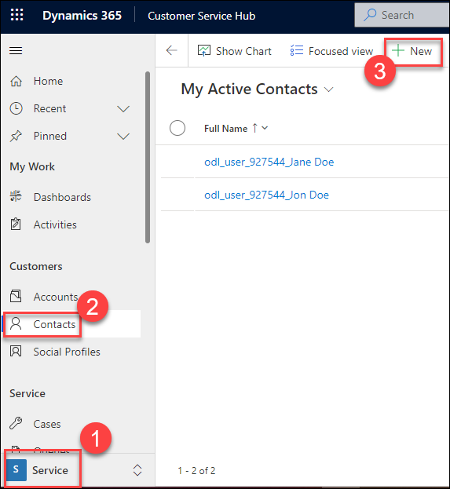

5.  Enter **odl_user_DID_Mike** for **First Name**, **Smith** for **Last Name**, and click **Save and Close**.

    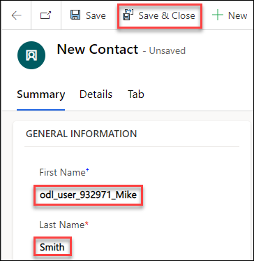

6.  Repeat the previous two steps and create the **Contact** records listed in the table below.

| **First Name**              | **Last Name** |
|-----------------------------|---------------|
| odl_user_DID_Jennifer       | Leary         |
| odl_user_DID_Judy           | Anderson      |
| odl_user_DID_Allan          | Jackson       |
| odl_user_DID_Sven           | Locarte       |
| odl_user_DID_Alex           | Nelson        |

7.  You should now have six contact records.

    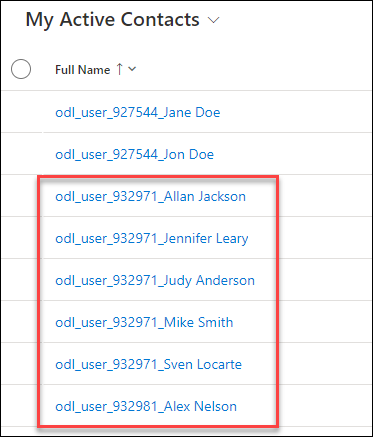

## Task 2: Create Resource Categories

In this task you will create new resource categories.

1.  Click on **Service** at the bottom of the **Site Map** in the left-hand navigation and select **Scheduling**.

2.  Click on **Resource Categories** in the **Scheduling** section.

3.  Click **+ New**.

4.  Enter **[your prefix ex. mollyc]** + **Senior Technician** for **Name** and click **Save and Close**.

5.  Click **+ New**.

6.  Enter **[your prefix ex. mollyc]** + **Technician** for **Name** and click **Save and Close**.

7.  Create two more **Resource Categories** and name them **[your prefix ex. mollyc]** + **Service Bay Facility** and **[your prefix ex. mollyc]** + **Tire Jack Equipment**.

8.  You should now have 4 **Resource Categories**.

9.  Do NOT navigate away from this application.

## Task 3: Create Resources

In this task you will create resources using the contacts you created.

1.  Click on **Resources** in the **Scheduling** section.

2.  Click **+ New**.

3.  Select **Contact** for **Resource Type**, select **Mike Smith** for **Contact**, and select the **Scheduling** tab.

4.  Select **Organizational Unit Address** for **Start** and **End Locations**, select **Main Avenue Location** for **Organizational Unit**, and click
    **Save**.

5.  Select the **Work Hours** tab, click on one of the events on the calendar, click **Edit**, and select **All events in the series**.

6.  Select **08:00 AM** to **04:30 PM** and click **Add Break**.

7.  Remove **Saturday** and **Sunday**, select **Observe Business Closure**, then click **Save**.

8.  Select the **General** tab.

9.  Select the **Related** tab and select **Resource Category Assns**  and click **+ New Bookable Resource Category Assn**.

10. Select **Senior Technician** and click **Save and Close**.

11. Repeat the previous 9 steps and create the resources listed in the table below.

| **Resource Type** | **Contact**    | **Start and End Locations** | **Organizational unit** | **Work Hours**                                               | **Resource Category Assn** |
|-------------------|----------------|-----------------------------|-------------------------|--------------------------------------------------------------|----------------------------|
| Contact           | Judy Anderson  | Organizational Unit Address | 19th Ave Location       | Mo – Fr 08:00AM to 04:30 PM + Break Observe Business Closure | Senior Technician          |
| Contact           | Sven Locarte   | Organizational Unit Address | 35th St Location        | Mo – Fr 08:00AM to 04:30 PM + Break Observe Business Closure | Senior Technician          |
| Contact           | Jennifer Leary | Organizational Unit Address | Main Avenue Location    | Mo – Fr 08:00AM to 04:30 PM + Break Observe Business Closure | Technician                 |
| Contact           | Allan Jackson  | Organizational Unit Address | 19th Ave Location       | Mo – Fr 08:00AM to 04:30 PM + Break Observe Business Closure | Technician                 |
| Contact           | Alex Nelson    | Organizational Unit Address | 35th St Location        | Mo – Fr 08:00AM to 04:30 PM + Break Observe Business Closure | Technician                 |

12. You should now have 6 resources. Click **+ New**.

13. Select **Facility** for **Resource Type**, select **19th Ave – Service Bay 1** for **Facility Equipment**, and select the **Scheduling** tab.

14. Select **Organizational Unit Address** for **Start** and **End Locations**, and then click **Save**.

15. Select the **General** tab.

16. Select the **Related** tab and select **Resource Category Assns**  and click **+ New Bookable Resource Category Assn**.

17. Select **Service Bay Facility** and click **Save and Close**.

18. Repeat the previous 3 steps and create the resources listed in the table below.

| **Resource Type** | **Facility Equipment**   | **Start and End Locations** | **Resource Category Assn** |
|-------------------|--------------------------|-----------------------------|----------------------------|
| Facility          | 19th Ave – Service Bay 2 | Organizational Unit Address | Service Bay Facility       |
| Facility          | 35th St – Service Bay 1  | Organizational Unit Address | Service Bay Facility       |
| Facility          | 35th St – Service Bay 2  | Organizational Unit Address | Service Bay Facility       |
| Facility          | Main Ave – Service Bay 1 | Organizational Unit Address | Service Bay Facility       |
| Facility          | Main Ave – Service Bay 2 | Organizational Unit Address | Service Bay Facility       |
| Equipment         | 19th Ave – Tire Jack     | Organizational Unit Address | Tire Jack Equipment        |
| Equipment         | 35th St – Tire Jack      | Organizational Unit Address | Tire Jack Equipment        |
| Equipment         | Main Ave – Tire Jack     | Organizational Unit Address | Tire Jack Equipment        |

19. You should now have 15 Resources.
