# Practice Lab 9 – Customer Service Scheduling Services

## Scenario

You are the scheduling manager at City Power & Light who has been tasked with testing the Service Scheduling functionality to perform services for customers at your locations.

## Exercise 1: Define Services

In this exercise, you will define oil change and tire rotation services.

### Task 1: Create Oil Change Service

In this task, you will create an oil change service.

1. Open the **Dynamics 365 - Customer Service Hub (1)** app.

2. Click on **Home** at the top of the left-hand side navigation.

3. Click on **Service** at the bottom of the **Site Map** in the left-hand navigation and select **Scheduling (2)**.

4. Click on **Services (3)** in the **Scheduling** section.

5. Click **+ New (4)**.

   

6. Enter **Oil Change** for **Name** and click **Save**.

   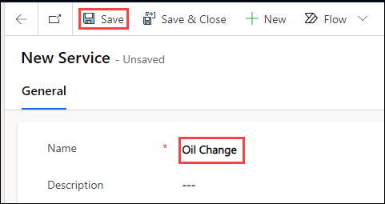

7. Select the **Resource Requirements** tab, change the **Name** to **Oil Change (1)**, select **All** for **Select**, and select **Organizational Unit (2)** for **Part of Same**.

   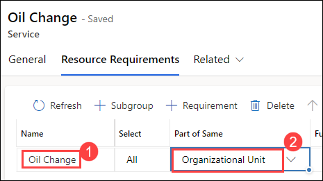

8. Click **+ Requirement** from the command bar.

9. Enter **30 minutes** for **Duration (1)**.

10. Enter **Service Technician** for **Name** and select **Technician (3)** for **Resource Category**.

11. Select the **Oil Change** row.

    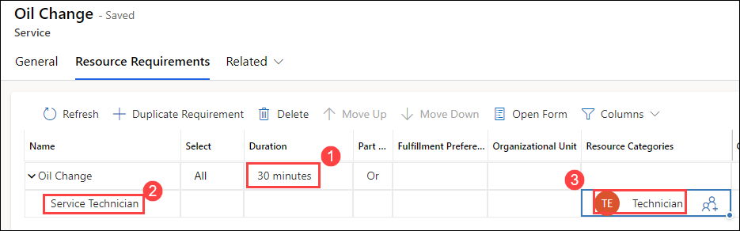

13. Select oil change and click **+ Requirement** from command bar.

14. Enter **Service Bay** for **Name (1)**, select **Service Bay Facility** for **Resource Category (2)**

    

15. Click **Save**

### Task 2: Create Tire Service

1. Click + **New** in the command bar.

2. Enter **Tire Rotation (1)** for **Name** and click **Save (2)**.

   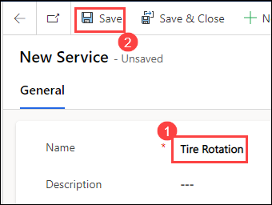

3. Select the **Resource Requirements** tab, change the **Name** to **Tire Rotation**, select **All** for **Select**, and select **Organizational Unit** for **Part of Same**.

4. Click **+ Requirement**.

5. Enter **1 hour** for **Duration**.

6. Enter **Senior Technician** for **Name** and select **Senior Technician** for **Resource Category**.

7. Select the **Tire Rotation** row and click **+ Requirement**.

8. Enter **Service Bay** for **Name** and select **Service Bay Facility** for **Resource Category**.

9. Select the **Tire Rotation** row and click **+ Requirement**.

10. Enter **Service Technician** for **Name** and select **Technician** for **Resource Category**.

11. Select the **Tire Rotation** row and click **+ Requirement**.

12. Enter **Tire Jack** for **Name** and select **Tire Jack Equipment** for **Resource Category**.

13. The **Tire Rotation** service should now have **4** requirements.

    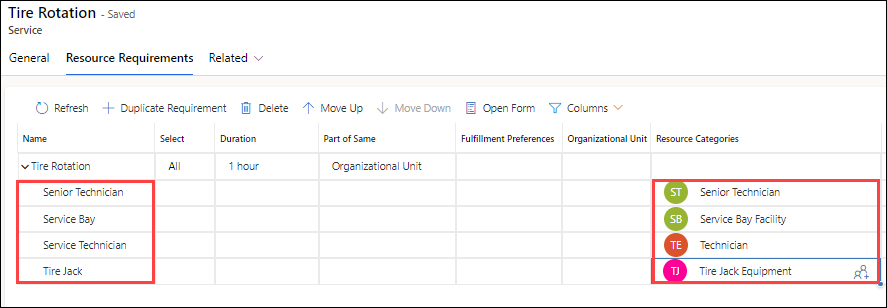
    
> **Congratulations** on completing the task! Now, it's time to validate it. Here are the steps:
> - Select the **Lab Validation** tab located at the upper right corner of the lab guide section.
> - Hit the Validate button for the corresponding task. If you receive a success message, you can proceed to the next task. 
> - If not, carefully read the error message and retry the step, following the instructions in the lab guide.
> - If you need any assistance, please contact us at labs-support@spektrasystems.com. We are available 24/7 to help you out.

## Exercise 2: Create and schedule Service activities 

In this exercise, you create and schedule service activities for an oil change and a tire rotation.

### Task 1: Schedule Oil Change Service

In this task you will create and schedule an oil change service activity.

1. Open the **Dynamics 365 - Customer Service Hub** app.

2. Click on **Home** at the top of the left-hand side navigation.

3. Click on **Service** at the bottom of the **Site Map** in the left-hand navigation and select **Scheduling (1)**.

4. Click on **Service Activities (2)** in the **Scheduling** section.

5. Click **Service Activity (3)** from the command bar.

   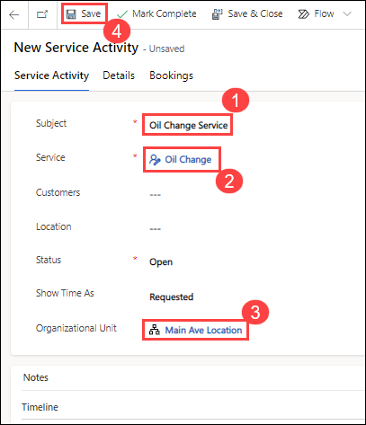

6. Enter **Oil Change Service (1)** for **Subject**, select **Oil Change (2)** for **Service**, select **Main Ave Location (3)** for **Organizational Unit**, and click **Save**.
    
   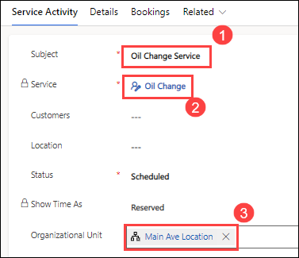

7. Click on **Book** from the command bar.

8. Go to the **Filter View (1)**, select **Main Ave Location** for **Organizational Unit (2)**, and click **Search (3)**.

   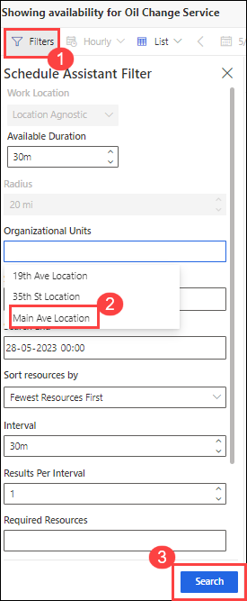

9. Expand one of the available slots and see what resources are included in it.

   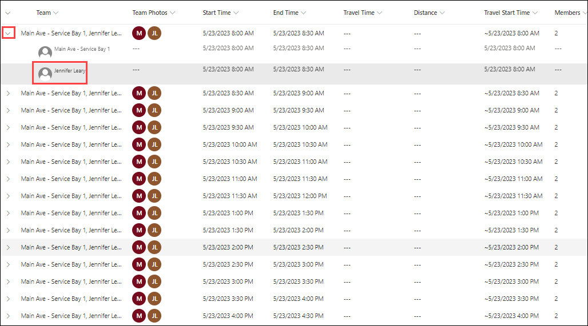

10. In our case Service Bay 1 and **Jennifer Leary (1)** will be included.

11 Click on the Team date from the list.

12. Select a **date one week from today(Do not select weekend date) (2)**. The rest of the dates will change to reflect the change you made.

13. Click **Book & Exit (3)**.

    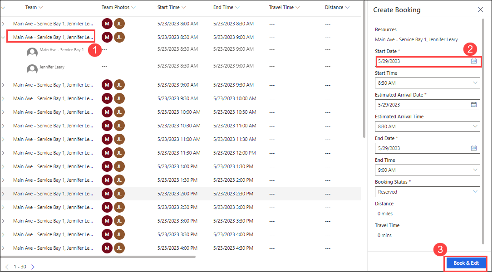

14. Refresh the service activity record.

15. The status should now change form **Requested** to **Scheduled**.

16. Select the **Bookings** tab. You should see the booked resources for this service activity.

    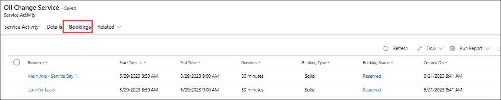

17. Click **Scheduling** in the **Tools** section.

18. Select **Main Ave Location** for **Organizational Units (1)** and click **Apply (2)**.

    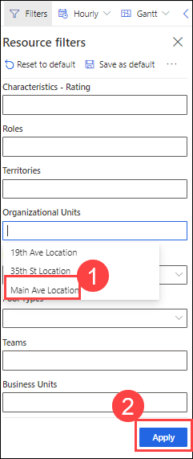

19. Select **Horizontal View** and click on the date picker.

20. Select the date you booked the **Oil Change** service activity.

21. **Jennifer Leary** and **Service Bay 1** should show as booked for **30** minutes. Click on the **Jennifer Leary’s** booking to get the details of booking.

    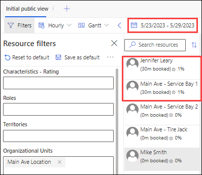

22. Go to the Details pane. You should see more information about the booking.

> **Congratulations** on completing the task! Now, it's time to validate it. Here are the steps:
> - Select the **Lab Validation** tab located at the upper right corner of the lab guide section.
> - Hit the Validate button for the corresponding task. If you receive a success message, you can proceed to the next task. 
> - If not, carefully read the error message and retry the step, following the instructions in the lab guide.
> - If you need any assistance, please contact us at labs-support@spektrasystems.com. We are available 24/7 to help you out.

**Result:** You have successfully created Customer Service Scheduling Services in this lab.
