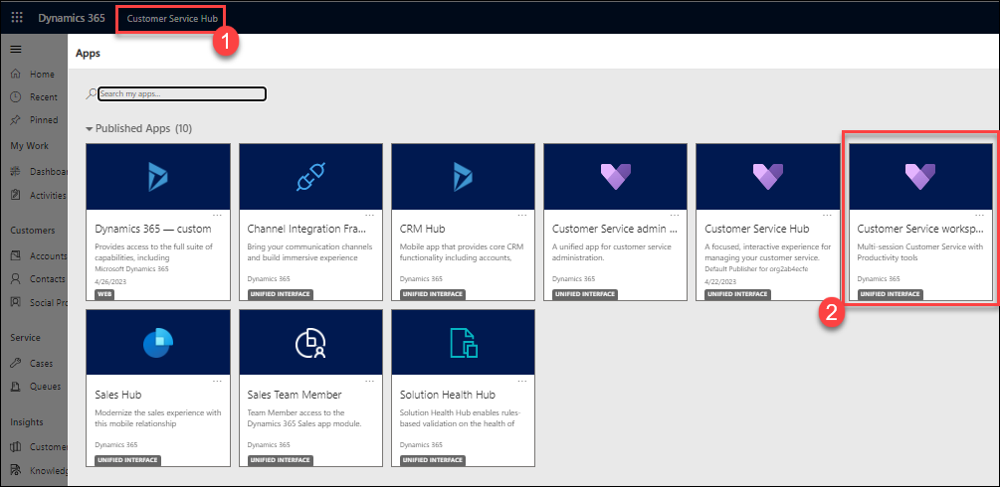
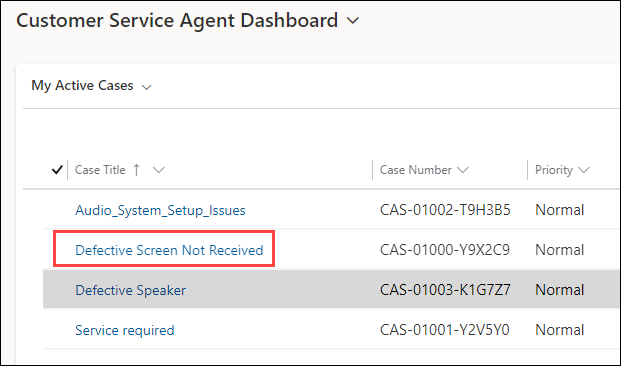
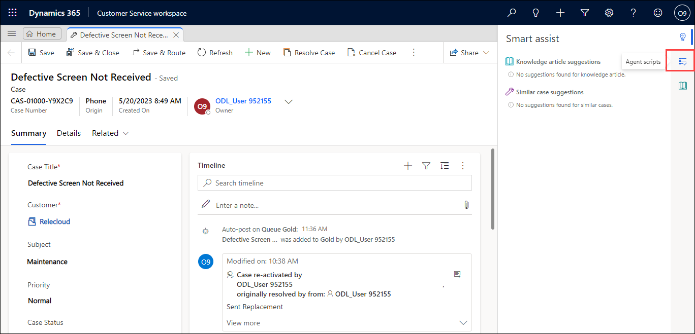
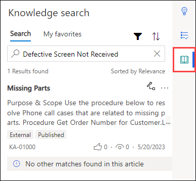
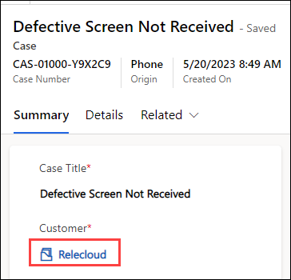
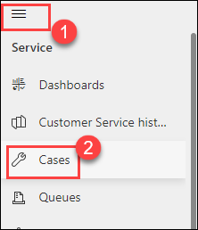
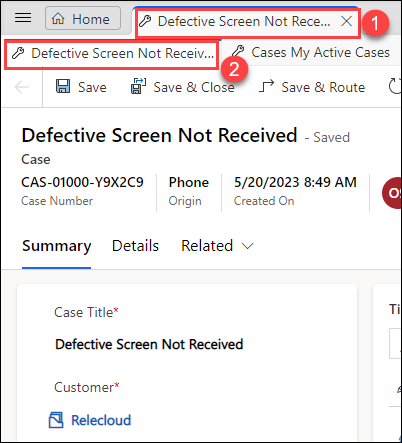

# Practice Lab 10 – Customer Service workspace

## Scenario

You are a customer service manager at City Power & Light who has been tasked with configuring the Customer Service workspace before rolling it out to your users. In this lab, you will explore how the the Customer Service workspace works.

## Exercise 1 – Navigate Customer Service workspace

In this exercise you will learn how to navigate the Customer Service workspace and use shortcut keys.

### Task 1 – Open the Customer Service workspace and open sessions

1.  Open the **Dynamics 365 - Customer Service Hub** app.

2.  Click on the name of the app in the top left of the application next to Dynamics 365 and from the list of published apps, select the **Customer Service workspace (2)** app.

    

3.  In the Customer Service Agent Dashboard, find the **Defective Screen Not Received** case, and click on the case to open it. A new session starts in the left-hand pane for the case and **Smart assist** opens in the **Productivity pane** on the right of the app with a list of knowledge article suggestions.

    

4.  Click on the **Agent scripts** icon on the Productivity pane. There are no scripts available.

    

5.  Click on the **Knowledge search** icon on the Productivity pane. There should be articles listed.

6.  Click on the **Knowledge search** icon on the Productivity pane to minimize the Productivity pane.

    

7.  Click on the **Relecloud** account in the **Customer** field on the case form. A new tab opens for the account.

    

8.  Switch to the account tab.

9.  Click on **Home** left to the account tab and select **Cases**.

    

10. Select the **Defective Speaker Not Received** case to select the case in the case list.

11. You should now have two sessions.

    

12. Select the first session for the **Defective Speaker Not Received** case and click on **Close the session** and confirm with **Close**.

13. Select the remaining session for the **Defective Speaker Not Received** case and click on **Close the session** and confirm with **Close**.

14. The Customer Service Agent Dashboard is displayed.

**Result:** You have successfully created customer Service workspace and displayed on the Customer Service Agent Dashboard. 
