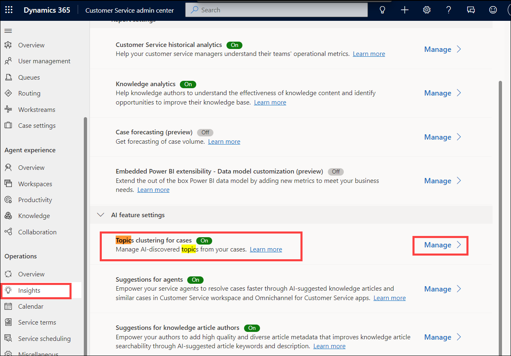
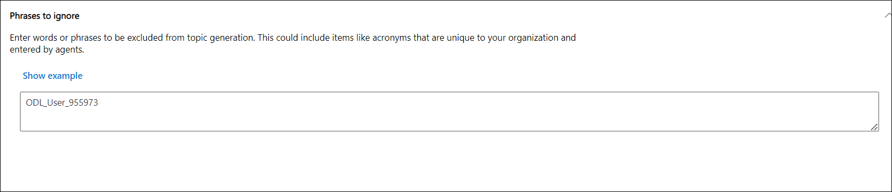
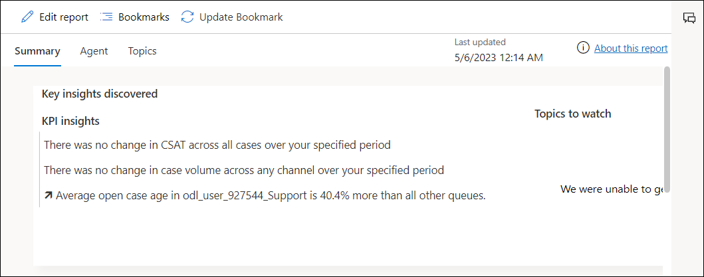
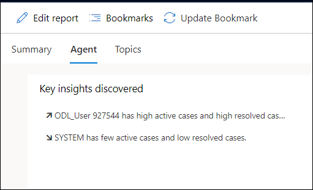
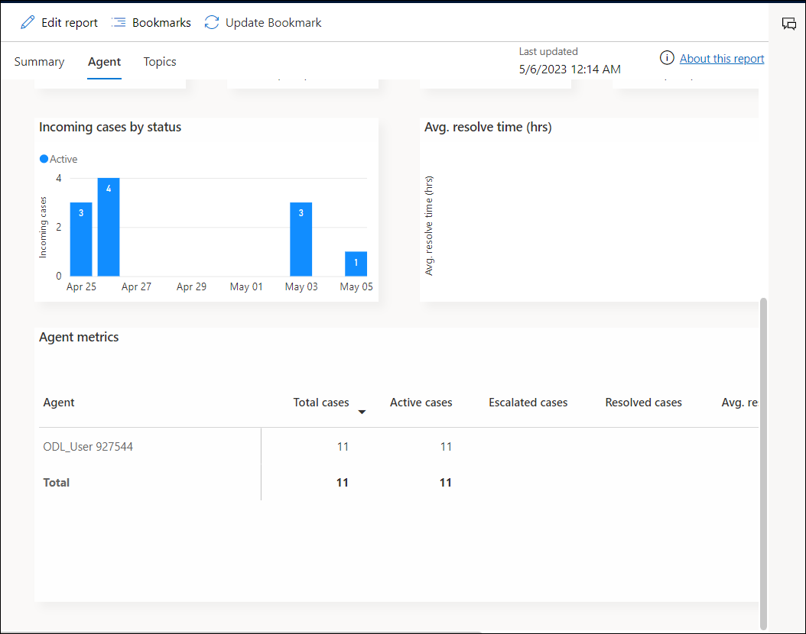

# Practice Lab 12 – Customer Service Insights

## Scenario

You are a customer service manager at City Power & Light who has been tasked with improving performance with the Customer Service Insights functionality.

## Exercise 1: Configure Topic clustering for case settings

In this exercise, you will learn how to manage topic clustering.

### Task 1: Configure how topics are grouped

1. Open the **Customer Service Admin center** app.

2. Click on **Home** at the top of the left-hand side navigation.

3. Under the **Operations** tab, select **Insights (1)**

4. Click on **Manage (2)** for **Topic clustering for case**.

    

6. In **Phrases to ignore** enter **ODL_User** and click **Save & close**

    

## Exercise 2: Review Customer Service Insights reports

In this exercise, you will learn how to use the reports generated by Customer Service Insights.

### Task 1: Configure how topics are grouped

1. Open the **Customer Service Hub** app.

2. Click on **Customer Service historical analytics** in the **Insights** section. 

    >**Note:** If the Insights section is not visible, you will need to wait 24 hours for Customer Service Insights to run.

2. Click on **Home** at the top of the left-hand side navigation.

3. Exam the KPIs and tables in the **Summary** tab.

   

4. Select the **Agent** tab.

5. Exam the KPIs and tables in the **Agent** tab.

   

6. Filter **Agent** by your user.

7. Under **Agent metrics**, view all the details.

   

8. Select the **Topics** tab.

9. Exam the KPIs and tables in the **Topics** tab.

**Result:** You have successfully Configured topic clustering for case settings in this lab.
