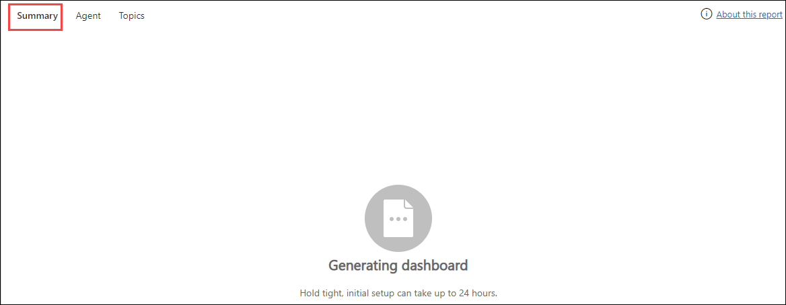

# Practice Lab 12 – Customer Service Insights

## Scenario

You are a customer service manager at City Power & Light who has been tasked with improving performance with the Customer Service Insights functionality.

## Exercise 1: Configure Topic clustering for case settings

In this exercise, you will learn how to manage topic clustering.

### Task 1: Configure how topics are grouped

1. Open the **Customer Service Admin Center** app.

2. Click on **Home** at the top of the left-hand side navigation.

3. Under the **Operations** tab, select **Insights (1)**

4. Click on **Manage (2)** for **Topic clustering for case**.

    

6. In **Phrases to ignore** enter **ODL_User_DID** and click **Save & close**

    >Note: The [DeploymentId]/[DID] can be found under the environment details tab in the user name (example: odl_user_xxxxxx.onmicrosoft.com) xxxxxx is the [DeploymentID].

    

## Exercise 2: Review Customer Service Insights reports

In this exercise, you will learn how to use the reports generated by Customer Service Insights.

>**Note: This exercise requires your environment to be active for around 24 hours before the data is populated. As a result, you will not be able to view the data in the following tasks if your environment hasn't been active for that long. You can however go through the steps and the screenshots showing what the insights will look like.**

### Task 1: Configure how topics are grouped

1. Open the **Customer Service Hub** app.

2. Click on **Home** at the top of the left-hand side navigation.

3. Click on **Customer Service historical analytics** in the **Insights** section.

5. Examine the KPIs and tables in the **Summary** tab.

   
   

6. Select the **Agent** tab.

7. Examine the KPIs and tables in the **Agent** tab.

   

8. Filter **Agent** by your user.

9. Under **Agent metrics**, view all the details.

   

10. Select the **Topics** tab.

11. Examine the KPIs and tables in the **Topics** tab.

**Result:** You have successfully Configured topic clustering for case settings in this lab.
