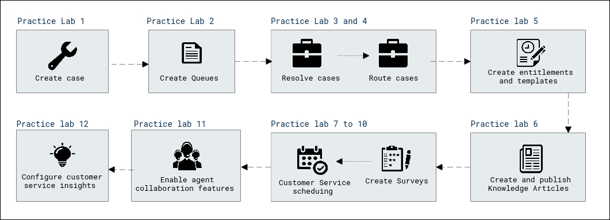

# Lab Scenario Preview: MB-230: Microsoft Dynamics 365 Customer Service Functional Consultant

### Lab overview

In this lab, you will learn the core concepts of effectively implementing and managing customer service solutions using Dynamics 365.

## Objective
  
After completing this lab, you will be able to:

- Create cases and queues
- Resolve and route cases
- Create Entitlements and surveys
- Configure Customer Service Scheduling
- Create App Profiles
- Perform Agent Collaboration and Customer Service Insights

## Architecture Diagram

 

Once you understand the lab's content, you can start the Hands-on Lab by clicking the **Launch** button located in the top right corner. This will lead you to the lab environment and guide. You can also preview the full lab guide [here](https://experience.cloudlabs.ai/#/labguidepreview/cf891fc3-dc77-46e3-b7b7-392fd76b990a) if you want to go through the detailed guide prior to launching lab environment.

