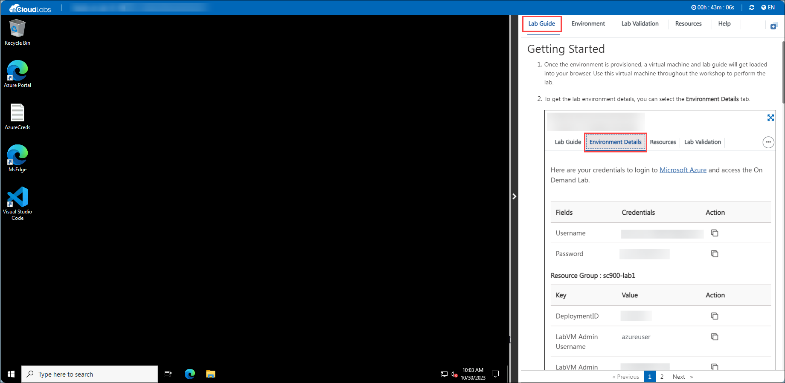
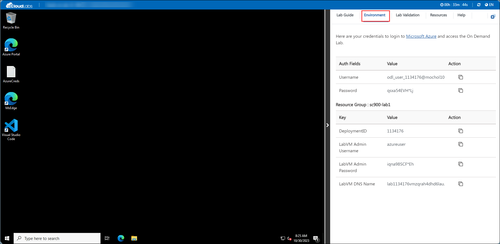

# Getting Started with Your MB-230-Dynamics365forCustomerService Workshop
 
Welcome to your MB-230-Dynamics365forCustomerService workshop! We've prepared a seamless environment for you to explore and learn about 
knowledge management, unified routing and queues, entitlements, resource scheduling, service- level agreements (SLAs), visualizations, connected services, Customer Service Insights, Power Virtual Agents etc. Let's begin by making the most of this experience:
 
## Accessing Your Lab Environment
 
Once you're ready to dive in, your virtual machine and lab guide will be right at your fingertips within your web browser.
 
   

### Virtual Machine & Lab Guide
 
Your virtual machine is your workhorse throughout the workshop. The lab guide is your roadmap to success.
 
## Exploring Your Lab Resources
 
To get a better understanding of your lab resources and credentials, navigate to the **Environment Details** tab.
 
   
 
## Utilizing the Split Window Feature
 
For convenience, you can open the lab guide in a separate window by selecting the **Split Window** button from the Top right corner.
 
   

Now you're all set to explore the powerful world of technology. Feel free to reach out if you have any questions along the way. Enjoy your workshop!

